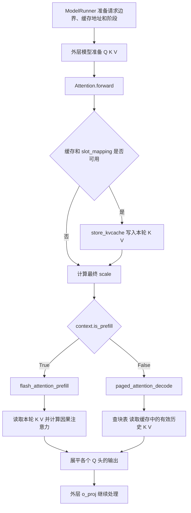

# 从零读懂 attention.py：先看计算，再逐行读代码

这份文档讲解的是你项目中当前的 [attention.py](/Users/tngpng/Documents/code/infar/MinivLLM/src/myvllm/layers/attention.py)，整理日期为 2026 年 10 月 3 日。它是一份代码阅读教材，不要求你已经学过 CUDA、Triton 或注意力机制。

我们要弄懂一件事：**一个 token 的 Q，怎样利用当前和历史 token 的 K/V，算出一个新的向量；代码又怎样让这个过程在 GPU 上分块执行。**

文档分成两种阅读方式：前四章按理解顺序打基础；第五章按调用关系逐个讲解函数：先说明定位和用途，再用具体例子讲清输入输出，最后在代码块中逐行注释，包括参数、跨行表达式和末尾旧示例。源文件中的长注释和说明字符串所表达的要点会融入函数说明，原文在附录中完整保留。空行负责排版，没有计算含义。你可以在文档中搜索“L488”这类编号定位某一行。

这里所有形状和数字都是教学用的例子，不是模型真实权重。阅读时不需要运行原文件；特别是末尾旧示例，存在与当前接口不一致的问题，第六章会解释。

## 阅读导航

- [一、先弄懂这段程序在算什么](#basics)
- [二、形状、地址和 GPU 语法](#layout)
- [三、在线 softmax：为什么能分块计算](#online-softmax)
- [四、把一次 prefill 和一次 decode 串起来](#journey)
- [五、以函数为单位理解，再读逐行注释](#line-by-line)
- [六、实现边界与容易踩的坑](#limits)
- [七、用纯 Python 复现一次完整的小计算](#worked-example)
- [八、检查自己是否真的读懂了](#questions)
- [附录：完整源码快照与参考资料](#appendix)

<a id="basics"></a>

## 一、先弄懂这段程序在算什么

### 1.1 token、向量、张量，先不要被名字吓住

模型处理文本时，先把文本变成 token 序列。token 是分词器定义的一段文本单位：有时是一个字，有时是一个词，有时只是词的一部分，不能固定理解为“一个汉字”。

进入神经网络以后，一个 token 用一串数字表示，比如 `[0.2, -0.7, 1.1]`。这串数字叫**向量**。向量中的每一个数是一维特征。它们通常不是人手指定的“性别”“颜色”等标签，而是模型学到的表示。

把多个 token 的向量排在一起，就是二维数字表；再加上“头”等维度，就是更高维的数组。PyTorch 把这些数组叫**张量 Tensor**。你现在可以把张量理解成“有形状的数字集合”。

注意区分“形状”和“内容”：`context_lens.shape == [2]` 表示里面有两个数；`context_lens == [3, 7]` 才表示这两个数分别是 3 和 7。

### 1.2 Q、K、V 是三个不同的数字表示

对某一个注意力头来说，每个 token 都有三个向量：

| 名字 | 初步理解 | 实际参与的运算 |
|---|---|---|
| Q，Query | 当前 token 想找什么信息 | 和各个 K 做点积 |
| K，Key | 每个 token 用来被匹配的表示 | 和当前 Q 计算匹配分数 |
| V，Value | 每个 token 可以提供的内容 | 按注意力权重加权求和 |

“查询、索引、内容”只是帮助理解的比喻。真正的 Q/K/V 都是数值向量，不是可直接阅读的问题和答案。

通常这些向量由输入表示经过线性投影得到。这个文件**接收已经准备好的 Q/K/V**。在本项目的 Qwen3 调用链中，投影、拆分头、按条件执行 Q/K 归一化，以及 RoPE 位置处理，都在外面的 `Qwen3Attention` 中完成。读这里时，可以把它们当成输入前的准备工作。

### 1.3 注意力的核心只有三个动作

先只看“一个 query、一个头”。假设当前 Q 能读取三个 token 的 K/V。

第一步，用 Q 和每个 K 做**点积**。例如：

```text
q = [1, 2]
k = [3, 4]
q · k = 1×3 + 2×4 = 11
```

点积得到一个匹配分数。这里还会乘上 `scale`。标准缩放是 `1/√D`，D 是每个头的宽度；这样做有助于控制点积随维度变大而变大的数值尺度。本代码还允许额外乘一个 `self.scale`。

第二步，把分数变成权重：

```text
权重[j] = exp(分数[j]) / 所有可见位置的 exp(分数) 之和
```

这就是 **softmax**。`exp(x)` 表示 e 的 x 次方。它把分数转成非负权重，使这些权重的总和为 1。分数较大的位置通常得到较大的权重。

第三步，用这些权重对 V 加权求和：

```text
输出 = 权重[0]×V[0] + 权重[1]×V[1] + 权重[2]×V[2]
```

输出仍是一个 D 维向量。它不是 token 编号，不是最终生成的文字，也不是三个 V 的简单拼接。后续模型层、词表投影和采样才负责得到下一个 token。

把这三步压缩成一行，就是文件中的公式：

```text
output = softmax(Q @ K.T × scale) @ V
```

`@` 表示矩阵乘法，`.T` 表示转置。多个 query 一起计算时，得分矩阵的每一行对应一个 query，每一列对应一个 key；softmax 对每一行单独进行，不能把所有行混在一起归一化。

### 1.4 因果注意力：只能看见自己和过去

假设一条请求有三个 token，记为 B0、B1、B2。这里的字母 B 是请求名字，不是 token 的实际内容。

| 当前 query | 可以读 B0 | 可以读 B1 | 可以读 B2 |
|---|---|---|---|
| B0 | 是 | 否 | 否 |
| B1 | 是 | 是 | 否 |
| B2 | 是 | 是 | 是 |

这叫**因果掩码 causal mask**：在位置 1 计算时，不允许使用位置 2 的信息。即使整段输入已经在 GPU 内存中，也仍然要遵守这个规则。

“掩码”就是一组 True/False 开关。注意力分数中不允许参与的位置会被压成很大的负数，让它们在 softmax 中几乎没有权重。后面会看到：内存读取也有掩码，但它的作用是阻止读取无效地址，和这里的数学作用需要分开理解。

### 1.5 为什么有多个头，为什么 Q 和 KV 的头数不同

“头 head”可以先理解为一套独立的注意力计算。每个头有自己的 Q，以及对应的 K/V。多头允许模型从不同的数值表示中汇总信息；不能预先断言某个头一定负责语法或某种固定语义。

本教材统一用：

```text
Q 头数 Hq = 4
K 头数 Hkv = 2，V 头数也为 2
每头宽度 D = 32
```

Q 头比 KV 头多。代码让多个 Q 头共用一组 K/V，这叫 **GQA，分组查询注意力**：

| Q 头编号 | 对应 KV 头编号 | 计算映射 |
|---|---|---|
| 0 | 0 | 0 // 2 = 0 |
| 1 | 0 | 1 // 2 = 0 |
| 2 | 1 | 2 // 2 = 1 |
| 3 | 1 | 3 // 2 = 1 |

每组大小是 `Hq // Hkv = 2`。共用 K/V 不代表共用 Q，也不代表合并输出：Q0 和 Q1 的分数可以不同，输出也可以不同。最后仍然有 4 个头的结果。

这里要求 `Hkv > 0` 且 `Hq % Hkv == 0`。如果两种头数相等，就是普通多头注意力 MHA；只有一个 KV 头时属于多查询注意力 MQA 的情况。

### 1.6 prefill 和 decode 到底差在哪里

**Prefill，处理一批输入 token。** 例如第一次输入一段提示词，要为这段话的多个 token 计算 Q/K/V，再计算各自的注意力输出。虽然模型生成时通常只用最后位置的输出去预测下一个 token，但中间层仍需要处理这些输入位置。

**Decode，逐步处理新 token。** 上一轮已经选出了一个新 token，这一轮把它作为输入，只为这个当前 token 计算新的 Q/K/V。旧 token 的 K/V 已经存着，直接复用即可。

以一条请求为例：

```text
prefill 输入：A0 A1
    ↓ 模型后续处理与采样，选出 A2
decode 输入：A2，读取 A0 A1 A2 的 K/V
    ↓ 模型后续处理与采样，选出 A3
decode 输入：A3，读取 A0 A1 A2 A3 的 K/V
```

因此 decode 的上下文长度**包含本轮输入 token**。注意力层先把它的 K/V 写入缓存，再执行读取，当前 token 才能关注自己。

历史 Q 通常不需要缓存：下一轮使用的是新 token 的 Q，不需要重新计算旧 query 的输出。历史 K/V 则仍然会被新 Q 访问。这解释了为什么叫 **KV cache**。

<a id="layout"></a>

## 二、形状、地址和 GPU 语法

### 2.1 整篇使用的一组尺寸

| 符号 | 数值 | 含义 |
|---|---|---|
| B | 2 | 本轮有两条请求 A、B |
| T | 5 | prefill 本轮共有 5 个 token，A 有 2 个，B 有 3 个 |
| Hq | 4 | 当前设备负责的 Q 头数 |
| Hkv | 2 | 当前设备负责的 K 头数、V 头数 |
| D | 32 | 一个头中的特征数 |
| S | 4 | 一个物理缓存块能装 4 个 token 的 KV |
| C | 6 | 缓存池一共有 6 个物理块 |
| M | 2 | 后文 decode 块表有两列 |

这些头数是**本地头数**。如果模型分布在多张 GPU 上，rank 可以理解为某个并行进程的编号；外层已把头分给不同 rank，本文件不再除一次 GPU 数量。单 GPU 时无需先掌握分布式细节。

Prefill 把两条请求的 token 首尾拼起来：

```text
全局行号       0    1    2    3    4
对应 token    A0   A1   B0   B1   B2
请求内位置     0    1    0    1    2
```

于是：

```text
q.shape = [5, 4, 32]  → 5 个 token，每个 4 个 Q 头，每头 32 个数
k.shape = [5, 2, 32]  → 5 个 token，每个 2 个 K 头，每头 32 个数
v.shape = [5, 2, 32]  → 5 个 token，每个 2 个 V 头，每头 32 个数
```

例如 `q[3, 1, 7]` 是 B1 的第 1 号 Q 头中的第 7 号特征。所有编号都从 0 开始。

### 2.2 前缀和告诉程序：哪里是一条请求的边界

`cu_seqlens = [0, 2, 5]` 记录累积长度，也叫长度前缀和。这里 `cu` 可以理解成 cumulative，累积的意思。

```text
A 的范围：[0, 2)，也就是行 0、1
B 的范围：[2, 5)，也就是行 2、3、4
```

`[a, b)` 表示包括 a，不包括 b。每条长度等于相邻边界之差：2−0=2，5−2=3。两条请求需要三个边界，所以前缀和长度是 `B+1`。

**拼在同一个张量中不代表可以互相关注。** 内核先按边界选出一条请求，再在它内部施加因果掩码，两道条件一起保证 A 和 B 不串线。

### 2.3 缓存像分了格子的仓库

K cache 和 V cache 是两个独立的仓库，布局相同：

```text
[C, S, Hkv, D] = [6, 4, 2, 32]
  │  │   │   └─ 一个头有 32 个特征
  │  │   └──── 一个 token 有 2 个 KV 头
  │  └──────── 一个块有 4 个 token 槽位
  └─────────── 一共有 6 个物理块
```

一个 token 槽位容纳的是**这个 token 的全部 KV 头**，不是某一个头。K 与 V 分别保存到各自缓存的同一坐标。

为了节省空间，请求的历史无需放在一整段连续物理内存中。例如 B 的前四个 token 放物理块 5，接下来几个放物理块 1。请求看起来仍是一条连续序列，物理存储却可以分散。

### 2.4 两张不同的“地址表”

先直接回答最容易卡住的地方：**`[2, -1]` 是请求 A 的一行地址记录。第一个数 `2` 表示“A 的第一组 token 存在物理块 2”；第二个数 `-1` 表示“A 没有使用第二组，这个位置只是补齐表格”。**

这两个数不是两个 token，也不是两个 token 的长度。要读懂这一行，必须把“数在第几列”和“数本身是多少”分开看。我们从头把这张表建出来。

#### 2.4.1 先把这一时刻有哪些 token 说清楚

本小节先固定在一个 decode 时刻，假设每个物理块最多装 **4 个 token 的 K/V**，即 `S=4`。当前有两条请求，名字叫 A、B，顺序始终是 A 在前、B 在后。

```text
请求 A：A0 A1 A2                  共 3 个 token
请求 B：B0 B1 B2 B3 B4 B5 B6      共 7 个 token
```

A0 表示请求 A 的第 0 号 token，B6 表示请求 B 的第 6 号 token；它们只是方便区分位置的名字。

因此：

```python
context_lens = [3, 7]
```

它的含义是：

| 列表中的位置 | 数值 | 用一句完整的话读出来 |
|---|---|---|
| 第 0 项，对应 A | 3 | 请求 A 有 3 个有效 token，位置是 0、1、2 |
| 第 1 项，对应 B | 7 | 请求 B 有 7 个有效 token，位置是 0 到 6 |

`context_lens` 只告诉程序“每条请求有多少个有效 token”，**没有告诉程序这些 token 的 K/V 存在哪里**。

这里的长度包含本轮输入 A2、B6。进入注意力读取之前，`forward` 会先把这两个当前 token 的 K/V 写入缓存。它们在这一轮尚未写入时，不应提前把对应槽位的旧内容当成有效 K/V 读取。

这是一个独立的教学快照，不是前文长度为 2、3 的两条请求同步向前一步后的状态。

#### 2.4.2 “逻辑块”就是按请求中的顺序，每 4 个 token 分一组

先不考虑 GPU 内存，把每条请求自己的 token 每 4 个分成一组，组编号从 0 开始。这样的组叫**逻辑块**。

```text
请求 A：
    逻辑块 0：[A0 A1 A2 空]
    逻辑块 1：不需要

请求 B：
    逻辑块 0：[B0 B1 B2 B3]
    逻辑块 1：[B4 B5 B6 空]
```

A 有 3 个 token，一个容量为 4 的块就装得下。B 有 7 个 token，一个块只能装前 4 个，所以需要两个块。

**逻辑块的编号是每条请求各自编号的。** A 有自己的逻辑块 0，B 也有自己的逻辑块 0；这不代表它们共用同一份存储。

另外，“逻辑块 1”是**第二个**逻辑块，因为编号从 0 开始。后面表格的第 0 列、第 1 列，也遵循这个编号方式。

#### 2.4.3 “物理块”才是缓存池里实际分配的存储块

假设本层缓存池有 6 个物理块，它们的编号是：

```text
物理块 0、物理块 1、物理块 2、物理块 3、物理块 4、物理块 5
```

现在假设缓存管理器做了以下分配：

```text
A 的逻辑块 0 → 放进物理块 2
B 的逻辑块 0 → 放进物理块 5
B 的逻辑块 1 → 放进物理块 1
```

这些 `2、5、1` 是示例中已分配的**物理块编号**。它们不是由长度 3、7 算出来的。实际分配取决于缓存管理器当时有哪些块可用等状态；注意力内核只按给定的表查地址。

写入当前 token 后，相关缓存内容可以画成：

| 物理块编号 | 槽位 0 | 槽位 1 | 槽位 2 | 槽位 3 |
|---|---|---|---|---|
| 1 | B4 的 KV | B5 的 KV | B6 的 KV | 不属于 B 的有效历史 |
| 2 | A0 的 KV | A1 的 KV | A2 的 KV | 不属于 A 的有效历史 |
| 5 | B0 的 KV | B1 的 KV | B2 的 KV | B3 的 KV |

这里只列出 A、B 使用的块，其他物理块的状态与本例无关。“不属于有效历史”不保证槽位里的内存数值恰好是零，只表示本轮不应该读取它作为有效 token。

表中“KV”是简写。实际 K cache 和 V cache 分开存储，但用相同的物理块号和槽位号定位；同一 token 槽还包含该 token 的所有 KV 头。

留意请求 B：它的 token 顺序是 B0、B1、……、B6，但物理存放顺序从块 5 跳到了块 1。**token 的先后顺序由逻辑位置决定，不由物理块编号的大小决定。**

#### 2.4.4 现在再来看 `block_tables = [[2, -1], [5, 1]]`

把这串方括号展开成一张表：

| 哪条请求，也就是表的行 | 第 0 列：逻辑块 0 放在哪个物理块 | 第 1 列：逻辑块 1 放在哪个物理块 |
|---|---|---|
| 第 0 行：A | 2 | −1 |
| 第 1 行：B | 5 | 1 |

对应写法就是：

```python
block_tables = [
    [2, -1],  # 第 0 行，属于 A
    [5,  1],  # 第 1 行，属于 B
]
```

外层方括号把所有请求的记录装在一起。里面每一对方括号是一条请求的记录。这张表有 2 行、2 列，所以形状为 `[2,2]`。

**逐个读四个格子：**

| 格子 | 格子中的数 | 完整解释 |
|---|---|---|
| A 行、第 0 列 | 2 | A 的逻辑块 0，也就是装 A0/A1/A2 的那组，放在物理块 2 |
| A 行、第 1 列 | −1 | A 没有使用逻辑块 1；这一列只是填充，没有对应物理块 |
| B 行、第 0 列 | 5 | B 的逻辑块 0，也就是装 B0/B1/B2/B3 的那组，放在物理块 5 |
| B 行、第 1 列 | 1 | B 的逻辑块 1，也就是装 B4/B5/B6 的那组，放在物理块 1 |

所以 `[2, -1]` 应该连起来读成：

> “这是 A 的地址记录。A 的第一组 token 去物理块 2 找；A 没有第二组，这里用 −1 占位。”

而 `[5, 1]` 应该读成：

> “这是 B 的地址记录。B 的第一组 token 去物理块 5 找；第二组去物理块 1 找。”

**列的位置表示“第几组”，格子里的数表示“实际存在哪块”。** 例如 A 行中的 `2`，意思是物理块编号为 2，不是“A 有两个逻辑块”，也不是“这是逻辑块 2”。

#### 2.4.5 A 明明只需要 `[2]`，为什么要补一个 `-1`

补齐之前，每条请求自己的地址列表完全可以写成：

```text
A：[2]       只有一项，因为只用了一个逻辑块
B：[5, 1]    有两项，因为用了两个逻辑块
```

但是当前包装器把这些记录做成一个**规则的二维张量**。二维表每一行需要同样多的列，内核也按统一列数计算行地址。

本批中最长的记录是 B，有两项，于是都补到两项：

```text
A：[2]     → [2, -1]
B：[5, 1]  → [5,  1]
```

因此，`-1` 只是在说“这个格子没有有效物理块”。它不代表最后一个物理块，也不代表要从末尾开始读。

**这一个 `-1` 与物理块 2 里尚未使用的第 3 号槽位，是两件不同的事：**

- 物理块 2 里的那个未使用槽位，属于 A 已有的逻辑块 0 内部。
- 表中的 `-1`，代表整份逻辑块 1 尚未使用，相当于没有分配第二组存储。

如果 A 下一次变成 4 个 token，A3 可以放进物理块 2 的槽位 3，A 的块表仍可为 `[2,-1]`。如果再变成 5 个 token，才需要第二个逻辑块；假设此时分配到物理块 4，A 的记录才会变成 `[2,4]`。这个 4 是额外假设的分配结果，不是固定分配规则。

#### 2.4.6 两张读取说明一起用：一个给长度，一个给地址

为什么已经有块表，还要 `context_lens`？因为块表告诉程序**有哪些存储块**，没有告诉它**最后一块用了几个槽位**。

例如 A 的 `[2,-1]` 只能说明 A 在这个示例中用了一个物理块，容量为 4。但有效长度可能是 1、2、3 或 4，仅看块表无法确定。

因此读取时需要两项信息配合：

```text
context_lens[0] = 3     → A 只读取位置 0、1、2
block_tables 的 A 行   → 这些位置都去物理块 2 找

context_lens[1] = 7     → B 只读取位置 0 到 6
block_tables 的 B 行   → 前 4 个去物理块 5，后 3 个去物理块 1
```

以 A2 为例，把完整的定位过程展开：

```text
1. 选请求 A：它是表中的第 0 行。
2. A2 的请求内位置是 2，小于 A 的长度 3，因此有效。
3. 每组容量 4：2 // 4 = 0，所以属于逻辑块 0，也就是第 0 列。
4. 查 A 行、第 0 列，数值是 2，所以去物理块 2。
5. 2 % 4 = 2，所以去这个物理块的槽位 2。
6. 得到位置：cache[2, 2, 对应KV头, :]。
```

再以 B6 为例：

```text
1. 选请求 B：它是表中的第 1 行。
2. B6 的请求内位置是 6，小于 B 的长度 7，因此有效。
3. 6 // 4 = 1，所以属于逻辑块 1，也就是第 1 列。
4. 查 B 行、第 1 列，数值是 1，所以去物理块 1。
5. 6 % 4 = 2，所以去这个物理块的槽位 2。
6. 得到位置：cache[1, 2, 对应KV头, :]。
```

`//` 是整除，告诉你“在第几组”；`%` 是取余，告诉你“在组内哪个位置”。最后的 `:` 表示取出这个头的所有特征。

源码中实际使用 PyTorch 张量，所以可以写 `block_tables[1, 1]` 查第二行第二列。上面为了展示内容写成普通 Python 嵌套列表；如果真用这个列表运行 Python，等价索引要写 `block_tables[1][1]`。

#### 2.4.7 最后再加入写入表 `slot_mapping`

上面说清了怎样找回历史。现在处理另一个问题：**本轮新算出的 K/V 应该写到哪里？**

在本小节同一个 decode 快照中，本轮输入的两个 token 按顺序是：

```text
本轮第 0 行：A2
本轮第 1 行：B6
```

它们的最终地址刚才已经算出来：A2 放物理块 2、槽 2；B6 放物理块 1、槽 2。

写入表将“物理块号、块内槽位”合成一个全池槽位编号：

```text
全池槽位 = 物理块号 × 每块容量 + 块内槽位

A2：2 × 4 + 2 = 10
B6：1 × 4 + 2 =  6
```

所以本轮的写入表是：

```python
slot_mapping = [10, 6]
```

第一项 10 对应本轮第 0 行 A2，第二项 6 对应本轮第 1 行 B6。**这里的 10 和 6 是 token 槽位编号，不是物理块编号。**

写入内核要把它拆回来：

```text
slot 10：10 // 4 = 2，10 % 4 = 2 → 物理块 2、槽 2
slot  6： 6 // 4 = 1， 6 % 4 = 2 → 物理块 1、槽 2
```

现在可以对照三份数据，分别读出它们的职责：

| 数据 | 本小节的内容 | 告诉程序什么 |
|---|---|---|
| `context_lens` | `[3,7]` | 读取历史时，A 有效到位置 2，B 有效到位置 6 |
| `block_tables` | `[[2,-1],[5,1]]` | 读取历史时，各请求的每一组 token 存在哪个物理块 |
| `slot_mapping` | `[10,6]` | 写入本轮 K/V 时，A2 写槽 10，B6 写槽 6 |

因此本轮的顺序是：先用 `slot_mapping` 把 A2/B6 写好，再用 `context_lens` 限定有效历史范围，用 `block_tables` 找到这些历史的实际地址。

前文第一次 prefill 的输入是另一批 `[A0,A1,B0,B1,B2]`，对应写入表为 `[8,9,20,21,22]`：它与这里的 `[10,6]` 不同，是因为**本轮要写的 token 不同**。写入表始终跟着“本轮输入的行顺序”走。

### 2.5 三维、四维数组怎样变成一条内存地址

GPU 内存里的数字可以看作顺次排列的一条长带子。连续的 `[T, Hkv, D]` 布局中，最右边的特征编号变化最快，然后是头编号，最后才是 token 编号。

访问 `key[t, h, d]` 时，要跳过：

```text
t 个完整 token，每个占 Hkv×D 个元素
h 个完整头，每个占 D 个元素
d 个头内特征

偏移 = t×Hkv×D + h×D + d
```

例如 B1 的第 1 号 KV 头是 `key[3, 1, :]`：先跳 3×2×32=192 个元素，再跳 1×32=32 个元素，得到这个头的起点 224。整个头读取偏移 224 到 255。

四维缓存多一层：

```text
cache[物理块 b, 块内位置 u, 头 h, 特征 d]
偏移 = b×S×Hkv×D + u×Hkv×D + h×D + d
```

B1 写入 `cache[5, 1, 1, :]`，起点为 `5×256 + 1×64 + 1×32 = 1376`。读取源向量 `[224..255]`，写到目的 `[1376..1407]`，内容保持不变。

这里的偏移单位是**元素个数**。指针的类型负责换算字节大小；你不需要在这个公式里再乘 2 或 4。

### 2.6 contiguous 为什么必要

有些张量经过转置或切片后，逻辑上看起来还是一个表，但实际内存间隔不再符合上面的简单公式。这个间隔叫 stride，步长。

本文件的 GPU 内核没有接收 stride 参数，而是直接使用固定地址公式，因此输入必须是预期的连续布局。`.contiguous()` 会返回内容相同、布局连续的张量；如果原本已经连续，就返回原张量，不一定发生复制。这一语义可对照 [PyTorch 官方说明](https://docs.pytorch.org/docs/stable/generated/torch.Tensor.contiguous.html)。

它不负责“理解请求边界”，也不负责“把 KV 头重复成 Q 头数”。它只处理内存排列。

### 2.7 `[:, None]`：只是加一根轴，为什么到处都是

先看一个简单例子：

```text
a = [10, 20]     shape=[2]
b = [ 0,  1, 2] shape=[3]

a[:, None] = [[10],       shape=[2,1]
              [20]]

b[None, :] = [[0,1,2]]    shape=[1,3]

a[:, None] + b[None, :] = [[10,11,12],
                           [20,21,22]]  shape=[2,3]
```

这叫**广播 broadcasting**：尺寸为 1 的轴可以在运算中对齐另一侧的长度。它不意味着你手工复制了一整张原始张量。

在 prefill 中，query 位置数组 `[64]` 变成 `[64,1]`，特征位置数组 `[32]` 变成 `[1,32]`，就能一次构造出 `[64,32]` 个地址。每个地址对应“某个 query 的某个特征”。

### 2.8 `axis` 表示沿哪一方向收拢

```text
x = [[1,2,3],
     [4,5,6]]

sum(x, axis=0) = [5,7,9]  # 两行相加，去掉行这一维
sum(x, axis=1) = [6,15]   # 每行内部相加，去掉列这一维
```

因此 `qk [query,key]` 沿 `axis=1` 求和，是每个 query 对所有 key 求和；decode 的 `k [feature,key]` 沿 `axis=0` 求和，是把一个 key 的各个特征相乘结果加起来，得到点积。

不要背“axis=0 就是 token”，应先认清当前数组每一轴代表什么。

### 2.9 Python 包装器与 Triton 内核分工

普通 Python 函数负责准备连续张量、分配输出、确定启动多少份工作。带 `@triton.jit` 的函数描述 GPU 要做的具体计算。JIT 可以理解为“使用时根据参数和设备编译出对应的 GPU 程序”。

`grid` 是工作分配网格。例如缓存写入的 `grid=(5,2)` 表示有 5×2=10 个 program 实例，每个负责一个 `(token, KV头)`。内核通过 `tl.program_id(0)` 和 `tl.program_id(1)` 知道自己负责哪个坐标。**一个 program 不是一个 CUDA thread**；它内部可以协作处理一整块数字。

`tl.constexpr` 标记供编译期使用的参数，比如头宽、计算块大小。对本代码而言，编译器需要这些值来决定局部数组形状等。普通 `: int` 或 `: torch.Tensor` 则是 Python 类型提示，并不会自动检查形状。

下面是阅读本文件足够用的词典；对应运算名称可查 [Triton 官方 API](https://triton-lang.org/main/python-api/triton.language.html)。

| 写法 | 在这里怎么理解 |
|---|---|
| `tl.arange(0, n)` | 同时拿到 0 到 n−1 的编号 |
| `tl.load(ptr)` | 从一组地址读数 |
| `tl.store(ptr, x)` | 把一组数写到一组地址 |
| `mask=条件, other=0` | 有效位置才读，无效位置用 0 代替 |
| `tl.dot(a, b)` | 两个二维块做矩阵乘法 |
| `tl.sum(x, axis=...)` | 沿某一轴加起来 |
| `tl.max(x, axis=...)` | 沿某一轴找最大值 |
| `tl.maximum(a,b)` | 对应位置在 a、b 中取较大者 |
| `tl.where(c,a,b)` | c 为真取 a，否则取 b |
| `tl.exp(x)` | 对各个数计算指数 |
| `tl.cdiv(a,b)` / `triton.cdiv(a,b)` | 向上取整的除法，比如 65/64 得 2 |

需要特别区分：`tl.load(..., mask=False)` 会阻止对应内存读取；先加载再 `tl.where` 不能补救越界读取。`load` 对 mask 和 other 的广播规则见 [官方 load 文档](https://triton-lang.org/main/python-api/generated/triton.language.load.html)。

### 2.10 两种“块”不能混为一谈

`block_size=S=4` 是缓存的存储单位：一个物理块能装 4 个 token。

`BLOCK_M=64`、`BLOCK_N=64` 是计算单位：一个 program 同时处理最多 64 个 query，一轮扫描最多 64 个 key。这里 M/N 是惯用的矩阵块命名；不要把 `BLOCK_M` 中的 M 当成本文块表列数 M。

一个计算块可以跨越多个物理缓存块。decode 中扫描 64 个历史位置时，会为每个位置分别查块表；它不会假设这 64 个位置都连续放在同一个物理块里。

<a id="online-softmax"></a>

## 三、在线 softmax：为什么能分块计算

### 3.1 先理解为什么减最大值

softmax 需要指数。分数很大时，`exp(分数)` 可能大得难以表示。所以常常先把每个分数都减去同一个最大值 m：

```text
exp(sj-m) / Σ exp(sk-m)
= [exp(sj)/exp(m)] / [Σ exp(sk)/exp(m)]
= exp(sj) / Σ exp(sk)
```

分子分母同时除以同一个数，结果不变。减掉最大值以后，最大的指数是 `exp(0)=1`，数值更容易处理。

### 3.2 如果 K/V 太长，不能一次把全部分数存下来怎么办

把 key 分成若干小块，依次处理。对每一个 query，只维护三个状态：

| 变量 | 含义 | 单个 query 时的形状 |
|---|---|---|
| m | 到目前为止最大的分数 | 一个数 |
| l | 以 m 为基准的所有指数权重之和 | 一个数 |
| acc | 以 m 为基准的、尚未归一化的 V 加权和 | D 个数 |

更精确地说，已经读过的位置 j 满足：

```text
l   = Σ exp(score[j] - m)
acc = Σ exp(score[j] - m) × V[j]
```

最终 `acc/l` 就是所需输出。`l` 是小写字母 L，用来表示累积和；不要看成数字 1。

### 3.3 新块出现更大的分数，旧结果怎么办

假设旧最大值为 m，新旧合并后的最大值为 `m_new`。旧的每一个权重都需要从旧基准改到新基准：

```text
exp(score-m_new)
= exp(score-m) × exp(m-m_new)
```

所以只要给整个旧 `l` 和旧 `acc` 同时乘一个系数：

```text
alpha = exp(m-m_new)
```

就不用再读一遍旧分数。接着把新块的贡献加进来：

```text
m_new = max(m, 新块最大分数)
alpha = exp(m-m_new)
p     = exp(新块分数-m_new)
acc   = acc×alpha + p @ 新块V
l     = l×alpha + sum(p)
m     = m_new
```

这里 `p` 还没有除以总和，它只是**未归一化指数权重**，不能直接说成最终注意力概率。`acc` 也是分子，最后还要除以 `l`。

### 3.4 完整手算一遍

为了让数字容易算，假设经过缩放的三个有效分数是：

```text
scores = [0, ln(2), ln(3)]
V0 = [1,0]，V1 = [0,1]，V2 = [1,1]
```

`ln` 是自然对数，所以 `exp(ln(2))=2`。这里仅写 V 的前两维，其他 30 维设成 0，仍然可以和 D=32 的例子对应。

一次性计算时，指数是 `[1,2,3]`，总和为 6，最终概率是 `[1/6,2/6,3/6]`。输出为：

```text
第一维 = 1/6×1 + 2/6×0 + 3/6×1 = 2/3
第二维 = 1/6×0 + 2/6×1 + 3/6×1 = 5/6
```

现在把三项分成“前两项”和“最后一项”两块。这是用来演示递推的小分组，不是在修改源码的 `BLOCK_N`。

| 步骤 | 最大值 m | 当前新块 p | 累计 l | 累计 acc |
|---|---|---|---|---|
| 初始 | 概念上 −∞ | 无 | 0 | [0,0] |
| 处理前两项 | ln(2) | [1/2,1] | 3/2 | [1/2,1] |
| 加入最后一项 | ln(3) | [1] | 2 | [4/3,5/3] |

第二次处理时，`alpha=exp(ln(2)-ln(3))=2/3`：

```text
l   = (3/2)×(2/3) + 1 = 2
acc = [1/2,1]×(2/3) + [1,1] = [4/3,5/3]
输出 = acc/l = [2/3,5/6]
```

和一次性计算完全一致。数学等价建立在精确算术下；实际 GPU 使用有限精度，且 prefill 会转换 `p` 的数据类型，所以不应要求结果逐比特相同。

### 3.5 对照本实现时要保留的两个区别

第一，代码用 `-1e10` 初始化 m，并用它表示被屏蔽的分数。它是 −100 亿这个有限值，并不是真正的负无穷。上面的推导展示理想算法；正常有限分数下，该数足够负，但极端数值条件不能因此被忽略。

第二，prefill 一个 program 同时处理多个 query，所以 m、l 都是一排数，`acc` 是一张 `[BLOCK_M,D]` 表；decode 一个 program 只处理一个 query，所以 m、l 是标量，`acc` 是 `[D]` 向量。数学原理相同，只是同时处理的 query 数量不同。

<a id="journey"></a>

## 四、把一次 prefill 和一次 decode 串起来

### 4.1 调用顺序与文件排列顺序不同

源码先定义底层函数，后定义 `Attention` 类。但正常执行时是从外层进来，再向下调用：



图中省略了部分参数，但顺序和源码一致。GPU 工作通常异步提交；正常同一执行流中的操作仍按依赖顺序执行，“先写后读”不代表 Python 每提交一次都必须同步等待。

### 4.2 一次 prefill：5 个 token 从哪里来，到哪里去

假设没有命中的缓存前缀，两条请求分别是 A0/A1 与 B0/B1/B2。

1. 运行器设置 `is_prefill=True`，前缀和 `[0,2,5]`，写入表 `[8,9,20,21,22]`。
2. 外层模型得到 Q `[5,4,32]`、K/V `[5,2,32]`。
3. `Attention.forward` 读取这些元信息，把五个 token 的 K/V 写入缓存。Q 不写入缓存。
4. 计算最终缩放 `1/√32≈0.176777`。
5. prefill 包装器把 Q/K/V 准备为连续布局，分配输出 `[5,4,32]`，启动网格 `(1,4,2)`。
6. 某个 program 比如 `(0,3,1)`，负责请求 B、第 3 号 Q 头、第一块 query。通过 GQA，它读第 1 号 KV 头。
7. 它按前缀和从拼接张量取出 B0/B1/B2，计算分数，屏蔽未来位置，累计 softmax 和 V。
8. 全部 program 写完后，输出仍是 `[5,4,32]`。最后展平成 `[5,128]`，交回外层 `o_proj`。

以 B1 为例，它只汇总 B0 和 B1 的 V；B2 不能参与，A0/A1 也不能参与。缓存写入和注意力计算是两件事：**这份 prefill 内核直接读本轮 K/V 张量，写进缓存是为了供后续步骤复用。**

### 4.3 另一个 decode 快照：当前只有 2 个 query，历史却有 3 和 7 个 token

这里采用源文件里的另一个独立快照：A 长度 3、B 长度 7。它不声称是上一节两条请求同步推进一步后的状态；如果同步各前进一步，长度应是 3 和 4。

已知 A0/A1，以及 B0 到 B5 的 K/V 已经存好。本轮输入为 A2、B6：

```text
Q shape          [2,4,32]
本轮 K/V shape   [2,2,32]
context_lens     [3,7]
block_tables     [[2,-1],[5,1]]
slot_mapping     [10,6]
```

先把 A2 写入物理块 2、槽 2，把 B6 写入物理块 1、槽 2。然后 decode 启动 `(2,4)` 共 8 个 program。

跟踪“请求 B、第 3 号 Q 头”这个 program：

| 步骤 | 得到什么 |
|---|---|
| 选请求、选头 | `batch_idx=1`，`head_idx=3` |
| 确定 KV 头 | `3 // (4 // 2) = 1` |
| 读取当前 Q | `query[1,3,:]`，32 个数 |
| 读取历史长度 | `context_len=7` |
| 展开历史位置 | 有效位置为 0、1、2、3、4、5、6 |
| 查询物理块 | 分别在块 5、5、5、5、1、1、1 |
| 块内位置 | 分别为 0、1、2、3、0、1、2 |
| 计算匹配分数 | 当前 Q 与这 7 个 K 逐个点积并缩放 |
| 汇总内容 | 对 7 个 V 做 softmax 加权，得到一个 32 维向量 |
| 写出 | `output[1,3,:]` |

这里没有二维三角因果掩码，因为唯一的 query 就在历史末尾位置 6，而读取范围 0..6 全都不是未来。无效槽位仍需屏蔽。

8 个 program 各自完成后，输出为 `[2,4,32]`，再展平为 `[2,128]`。**输出行数对应当前 query 数，不能因为 B 有 7 个历史 token 就认为要输出 7 行。**

### 4.4 Context 从哪里来，缓存又是谁分配的

`Context` 是本轮推理的“附加说明”。[context.py](/Users/tngpng/Documents/code/infar/MinivLLM/src/myvllm/utils/context.py) 中的 `set_context(...)` 保存它，`get_context()` 取回它。它不直接装全部历史 K/V，而是装阶段、长度、槽位表、块表等元信息。

在 [model_runner.py](/Users/tngpng/Documents/code/infar/MinivLLM/src/myvllm/engine/model_runner.py:340) 的 `prepare_prefill` 中，运行器整理拼接输入、前缀和及写入表；在 `prepare_decode` 中，为每条请求取最后一个 token，并构建当前上下文长度与块表。

同一运行器的 `allocate_kv_cache` 分配整体缓存，并把其中一层的 K/V 切片分别赋给 `module.k_cache` 和 `module.v_cache`。每层都有自己的 K/V 内容。块编号规划可以共用，但不同层缓存里的数值不是同一份。

`Qwen3Attention` 调用本文件后，再执行输出投影。最后的头展平只是调整形状，输出投影才会应用学习到的权重；这两个步骤不能混为一谈。

<a id="line-by-line"></a>

## 五、以函数为单位理解，再读逐行注释

这一章按**实际调用关系**阅读。每个函数都先回答“它负责什么、为什么需要它、输入是什么、输出是什么”，再给出带中文注释的完整代码块。你不必先记住某一行地址公式，先知道这个函数要完成什么任务。

下面会反复使用同一组配置：Q 头数 `Hq=4`，KV 头数 `Hkv=2`，每头宽度 `D=32`，每个物理缓存块能放 `S=4` 个 token，缓存池有 `C=6` 个物理块。

代码块保留全部有效代码，在对应行前加入 `# L原行号：解释`。原来的长篇注释与文档字符串不重复放进教学代码块，完整原文仍在附录 A。每个代码块用于阅读与对照；它们之间有调用依赖，不能把任何一个片段当成独立可运行的程序。

先看本章的路线：

```text
文件导入：准备 torch、triton 和 get_context
    ↓
Attention.__init__：保存配置，准备缓存占位属性
    ↓ 外部运行器分配缓存、准备 Context，外层模型产生 Q/K/V
Attention.forward：组织本轮计算
    ├─ store_kvcache：准备写缓存任务
    │      └─ store_kvcache_kernel：真正把 K/V 写到缓存地址
    │
    ├─ prefill 分支：flash_attention_prefill
    │      └─ flash_attention_varlen_kernel：对本轮多 token 算因果注意力
    │
    └─ decode 分支：paged_attention_decode
           └─ paged_attention_decode_kernel：当前 Q 读取分页历史，算注意力
```

其中“包装器”是普通 Python 函数，负责准备和启动；“内核”是 GPU 上实际执行搬运或计算的程序。一个函数没有 `return Tensor`，也可能产生结果，例如向传入的缓存写数据。下面会明确区分**返回值**和**被修改的张量**。

### 5.1 文件导入：先准备哪些工具

#### 这段代码的定位，以及为什么需要它

它位于整个文件的开头，为后续函数引入依赖。PyTorch 负责张量和模型模块；Triton 负责 GPU 内核；本项目的 `get_context` 负责取本轮推理的元信息。

例如，后面创建输出张量需要 `torch.empty_like`；启动内核需要 `triton`；判断本轮是不是 prefill 需要 `get_context()`。这些名字都从这里获得。

#### 输入与输出

这不是接收 Q/K/V 的计算函数，没有张量输入和注意力输出。导入执行后，文件里可以使用 `triton`、`tl`、`get_context`、`torch`、`nn` 这些名字。源码 L1–L62 是说明文字，本身不执行其中描述的注意力计算。

#### 带逐行注释的代码

```python
# L64：导入 Triton。Python 侧要用它的 JIT 装饰器、向上取整除法和 GPU 内核启动机制。
import triton
# L65：导入 Triton 的计算语言，简称 tl。后面的 tl.load、tl.dot 等描述 GPU 内的操作，不能
# 简单当成普通 Python 列表运算。
import triton.language as tl
# L66：导入本项目的 get_context。输入 q/k/v 本身没有告诉程序各行属于哪条请求，这个函数负
# 责取回本轮的附加说明。
from myvllm.utils import get_context
# L67：导入 PyTorch，负责张量、设备、数据类型等。
import torch
# L68：把 torch.nn 简称为 nn。最后的 Attention 会继承 nn.Module，使它能作为模型中的一个
# 模块被调用。
import torch.nn as nn
```

### 5.2 `Attention.__init__`：创建一层注意力的配置

#### 这个函数的定位，以及为什么需要它

当外层模型创建 `Attention(...)` 时，先调用这个构造方法。它负责把“有多少个头、每个头多宽、一个缓存块装多少 token”等配置保存起来，供以后每一轮 `forward` 使用。

为什么需要保存配置？后面的内存地址计算离不开这些尺寸。例如，一个 token 的 K 有多少个数，是 `num_kv_heads × head_dim`；如果不知道这两个值，就无法计算下一个 token 从哪里开始。

它还建立 `k_cache`、`v_cache` 两个属性。**这时只是空占位，真实缓存由外面的运行器分配后赋进来。** 创建对象和分配整个缓存池是两个步骤。

#### 输入：用一次具体创建来理解

```python
layer = Attention(
    num_heads=4,       # 本设备负责 4 个 Q 头
    head_dim=32,       # 每个头 32 个数
    scale=1.0,        # 额外缩放系数
    num_kv_heads=2,   # 每个 token 只有 2 个 K 头、2 个 V 头
    block_size=4,     # 每个物理块装 4 个 token 的 K/V
)
```

`scale=1.0` 还不是最终送入内核的缩放值；`forward` 会再除以 `√32`。如果省略 `num_kv_heads`，它默认等于 Q 头数；如果省略 `block_size`，源码默认是 16，而不是例子中的 4。

#### 输出：得到什么，又还缺什么

从 Python 使用者的角度，`Attention(...)` 创建了对象 `layer`；`__init__` 自己不返回这个对象，而是在已经创建的对象上设置属性。

```text
layer.num_heads    = 4
layer.num_kv_heads = 2
layer.head_dim     = 32
layer.block_size   = 4
layer.scale        = 1.0
layer.k_cache     = 空张量
layer.v_cache     = 空张量
```

稍后运行器会把两个缓存属性分别替换为 `[6,4,2,32]` 的真实 K/V 缓存。此函数还没有处理任何 token，没有生成注意力输出，也没有为 QKV 投影建立可学习权重。

#### 带逐行注释的代码

下面连同 `class Attention(nn.Module)` 一起展示，让你看到构造方法属于哪个类。后面的 `forward` 同样属于这个类，会在下一节单独展示。

```python
# L584：定义 Attention 类，继承 PyTorch 的 nn.Module。它把缓存写入、阶段判断和注意力内核
# 组织成一个模型模块。
class Attention(nn.Module):

    # L602：定义构造方法，创建 Attention 实例时调用，负责保存配置和初始化占位属性。
    def __init__(
        # L603：self 代表当前这个 Attention 对象，后面 self.xxx 都是它自己的属性。
        self,
        # L604：num_heads 是本地 Q 头数。示例为 4，调用方已经完成并行分片时不能再除以并
        # 行数量。
        num_heads: int,
        # L605：head_dim 是每个头的宽度 32，而不是所有头拼起来的宽度 128。
        head_dim: int,
        # L606：scale 默认 1.0，是额外缩放因子。真正传进内核时还会除以 √D。
        scale: float = 1.0,
        # L607：num_kv_heads 可省略，省略时值为 None，稍后会使用 Q 头数。这里标注 int 但
        # 默认 None，是现有代码的类型提示写法，Python 不会因此拒绝默认值。
        num_kv_heads: int = None,
        # L608：block_size 默认 16。教材为了容易计算显式使用 4；不要把教材的 4 当成构造
        # 函数默认值。
        block_size: int = 16,
    # L609：构造方法参数列表结束。
    ):
        # L610：调用父类 nn.Module 的初始化，准备 PyTorch 模块所需的内部管理结构。
        super().__init__()
        # L611：把 Q 头数保存到对象中，之后 forward 使用同一份配置。
        self.num_heads = num_heads
        # L612：保存每头宽度。
        self.head_dim = head_dim
        # L613：保存额外缩放系数，不是在这里计算最终 1/√D。
        self.scale = scale
        # L615：如果调用方提供了 KV 头数就用它，否则采用 Q 头数。条件表达式的含义是“满足
        # 条件取前者，否则取后者”。
        self.num_kv_heads = num_kv_heads if num_kv_heads is not None else num_heads
        # L616：保存物理缓存块容量。
        self.block_size = block_size
        # L621：创建一个空张量，并让两个缓存属性先指向同一个占位对象。后续运行器分别赋予
        # 真实 K/V 缓存切片。它们没有注册成参数或 buffer，因此不能指望只调用本模块 .cuda
        # () 就把这些普通属性自动分配成 GPU 缓存。
        self.k_cache = self.v_cache = torch.tensor([])
```

### 5.3 `Attention.forward`：组织一轮注意力计算

#### 这个函数的定位，以及为什么需要它

外层模型写 `layer(q, k, v)` 时，PyTorch 会进入这个方法。它是本文件的主要入口，把其他函数组织成一次完整操作。

为什么不能直接拿 `q @ k.T` 算完？因为本项目还要解决三个问题：本轮新 K/V 要留给未来使用；多条请求不能混在一起；prefill 与 decode 的数据来源不同。`forward` 负责安排这些步骤，具体的 GPU 计算交给下面的函数。

它的执行顺序是：读取 Context → 条件满足时保存本轮 K/V → 计算最终缩放 → 按阶段调用注意力 → 将各头结果展平。

#### 输入：除了 Q/K/V，还会读取哪些数据

它显式接收三个张量：`q`、`k`、`v`。此外还从对象读取 K/V 缓存，通过 `get_context()` 读取请求边界、写入地址与阶段信息。这些是它正常计算同样需要的输入条件，只是没有写在参数列表里。

**例子 A：prefill，两条请求共 5 个 token。**

```text
输入行顺序       [A0, A1, B0, B1, B2]
q.shape          [5,4,32]
k.shape          [5,2,32]
v.shape          [5,2,32]

Context：
    is_prefill   True
    cu_seqlens_q [0,2,5]
    slot_mapping [8,9,20,21,22]

对象上的缓存：
    k_cache.shape = v_cache.shape = [6,4,2,32]
```

`[0,2,5]` 告诉它前两行属于 A，后三行属于 B。写入表告诉它先把 A0/A1 存进物理块 2，B0/B1/B2 存进物理块 5。Prefill 的注意力计算本身读取本轮传入的 K/V。

**例子 B：另一个 decode 快照，只处理 A2、B6。**

```text
本轮输入行       [A2,B6]
q.shape          [2,4,32]
k.shape          [2,2,32]
v.shape          [2,2,32]

Context：
    is_prefill   False
    context_lens [3,7]
    block_tables [[2,-1],[5,1]]
    slot_mapping [10,6]
```

此时旧历史已经在缓存里，`forward` 先存当前 A2/B6，再让当前 Q 读取各自有效历史。`[2,-1]` 等表项的意义见第 2.4 节。两个例子是不同状态，不能把 B 长度从 3 到 7 理解成同步生成了一步。

#### 输出：形状发生什么变化，数值代表什么

| 情况 | 内核先算出的结果 | `forward` 返回值 |
|---|---|---|
| Prefill 例子 | `[5,4,32]`，每个输入 token 的每个 Q 头一个向量 | `[5,128]` |
| Decode 例子 | `[2,4,32]`，每条请求当前 token 的每个 Q 头一个向量 | `[2,128]` |

例如某个 token 的四个头输出为 `o0、o1、o2、o3`，每个长 32，返回的该行就是按顺序展开的 128 个数。不是把四个头加起来。外层 `o_proj` 会继续对这个结果做输出投影。

此外还有一个效果：当缓存与 `slot_mapping` 可用时，缓存已包含本轮新 K/V。这个效果不能从返回张量的形状里看出来，但对下一轮 decode 非常重要。

#### 带逐行注释的代码

下面单独展示类中的 `forward` 方法。它仍属于上一节的 `Attention`，并不是新定义一个顶层业务函数。

```python
# L623：定义 forward，接收本轮 Q/K/V 并返回注意力输出。通常写 layer(q,k,v) 会经由 nn.Mod
# ule 的调用机制进入这里。
def forward(self, q: torch.Tensor, k: torch.Tensor, v: torch.Tensor) -> torch.Tensor:
    # L626：取出运行器之前设置的 Context。函数不是根据 q 的大小猜 prefill 或 decode。
    context = get_context()
    # L628：用两个局部变量引用当前层的缓存。这里没有复制缓存内容，写入仍作用于原缓存。
    k_cache, v_cache = self.k_cache, self.v_cache

    # L632：只有 K 缓存非空、V 缓存非空、slot_mapping 已提供，才执行写入。numel()>0 判断
    # 有无实际元素。跳过写入不代表后续 decode 自动有可用历史。
    if k_cache.numel() > 0 and v_cache.numel() > 0 and context.slot_mapping is not None:
        # L633：检查 k 是否为四维。如果是，则专门为写缓存做一次展平处理。
        if k.dim() == 4:
            # L638：把四维 K 的形状依次解包为请求数 B、每请求 token 数 N、KV 头数和头宽
            # 。
            B, N, num_kv_heads, head_dim = k.shape
            # L639：把 K 的前两维合成 B×N，得到 [B*N,Hkv,D]，并保证连续。顺序是第一条请
            # 求的 N 行，然后第二条的 N 行。
            k_to_store = k.reshape(B * N, num_kv_heads, head_dim).contiguous()
            # L640：对 V 做同样的展平。两者必须采用相同的 token 顺序和槽位映射。
            v_to_store = v.reshape(B * N, num_kv_heads, head_dim).contiguous()
        # L641：如果 K 不是四维，则走下面这条通常使用的分支。
        else:
            # L643：把本轮 K 准备成连续布局，通常形状已经是 [T,Hkv,D]。
            k_to_store = k.contiguous()
            # L644：同样处理本轮 V。这里没有改变原变量 q/k/v 供后面的注意力分支使用的形
            # 状。
            v_to_store = v.contiguous()

        # L648：调用缓存包装器：把本轮 K/V 按 slot_mapping 写进当前层缓存。decode 中这一
        # 步必须先完成，后面的历史读取才能包含当前 token。
        store_kvcache(k_to_store, v_to_store, k_cache, v_cache, context.slot_mapping, self.block_size)

    # L652：计算最终 scale=self.scale/(D**0.5)。** 是乘方，0.5 次方就是平方根；D=32、sel
    # f.scale=1 时约 0.176777。
    scale = self.scale / (self.head_dim ** 0.5)

    # L654：读取 Context 的阶段开关。True 走 prefill，False 走下面的 decode。
    if context.is_prefill:
        # L657：取出 prefill 的请求边界表 cu_seqlens_q。
        cu_seqlens = context.cu_seqlens_q
        # L659：检查是否缺失边界表。None 是“没有提供”，不是零长度张量。
        if cu_seqlens is None:
            # L660：缺失就抛出 ValueError 并说明必须提供变长注意力边界。仅凭 5 个输入 to
            # ken 无法知道请求长度是 [2,3] 还是 [1,4]。
            raise ValueError("cu_seqlens_q must be provided for varlen attention")

        # L664：调用 prefill 包装器，传当前 q/k/v、请求边界和最终缩放值。
        o = flash_attention_prefill(q, k, v, cu_seqlens, scale,
                                    # L665：继续上一行，传本地 Q 头数、KV 头数和头宽，然后把返
                                    # 回的三维结果赋给 o。
                                    self.num_heads, self.num_kv_heads, self.head_dim)
        # L668：把 [T,Hq,D] 展平为 [T,Hq*D] 并返回。例 [5,4,32]→[5,128]，保留所有 token
        # ，不对各头求平均，也不跨设备收集。
        return o.reshape(o.shape[0], self.num_heads * self.head_dim)
    # L669：is_prefill 为 False 时进入 decode 分支。
    else:
        # L673：开始调用 decode 包装器，把下面列出的实参传入。
        o = paged_attention_decode(
            # L674：传入当前 Q；通常每条请求一个 query。
            q,
            # L675：传入当前层 K 缓存。decode 不直接拿本轮 k 作为全部历史。
            k_cache,
            # L676：传入当前层 V 缓存。
            v_cache,
            # L677：从 Context 取块表，决定历史的每一逻辑块存在哪个物理块。
            context.block_tables,
            # L678：从 Context 取每条请求的有效上下文长度，含当前 token。
            context.context_lens,
            # L679：传最终缩放值。
            scale,
            # L680：传本地 Q 头数。
            self.num_heads,
            # L681：传本地 KV 头数。
            self.num_kv_heads,
            # L682：传每头宽度。
            self.head_dim,
            # L683：传物理块容量，用于从历史位置推算逻辑块和块内偏移。
            self.block_size
        # L684：结束调用，得到三维结果 o [B,Hq,D]。
        )
        # L686：将当前各 query 的多头结果展平为 [B,Hq*D] 并返回。这个类的本轮工作到此结
        # 束，外层模型继续执行 o_proj 等操作。
        return o.reshape(o.shape[0], self.num_heads * self.head_dim)
```

### 5.4 `store_kvcache`：准备“把本轮 K/V 存起来”的任务

#### 这个函数的定位，以及为什么需要它

`forward` 在注意力计算之前调用它。它是**缓存写入的 Python 包装器**：整理 K/V 的内存布局、做有限的条件检查，然后决定启动多少个 GPU program。

为什么需要这个包装层？GPU 内核按固定公式计算地址，因此输入必须具有预期的连续布局；同时，Python 需要提前告诉 GPU“这次有几个 token、几个 KV 头需要写”。包装器负责把这些条件准备好，写入动作由下一节的内核完成。

#### 输入：五个新 token 和它们的目的地址

| 参数 | 具体例子 | 解释 |
|---|---|---|
| `key` | `[5,2,32]` | A0/A1/B0/B1/B2 的新 K |
| `value` | `[5,2,32]` | 相同顺序的新 V |
| `k_cache` | `[6,4,2,32]` | 已分配的 K 仓库 |
| `v_cache` | `[6,4,2,32]` | 已分配的 V 仓库 |
| `slot_mapping` | `[8,9,20,21,22]` | 五个 token 的目的槽位 |
| `block_size` | `4` | 每个物理块有四个槽 |

为了跟踪数值，假设 `key[3,1,:]` 的前几个数为 `[0.2,0.4,0.6,...]`，`value[3,1,:]` 为 `[1,2,3,...]`。这里第 3 行是 B1，第 1 号头是它的第二个 KV 头。

#### 输出：没有返回张量，而是改变缓存

函数没有显式 `return`，Python 返回 `None`。结果体现在传入的缓存内容中：

```text
slot_mapping[3] = 21
21 // 4 = 5，21 % 4 = 1

k_cache[5,1,1,:] 变成 [0.2,0.4,0.6,...]
v_cache[5,1,1,:] 变成 [1,2,3,...]
```

其他 token 和头也按各自槽位写入。这里不做 softmax，不修改这些向量的数学含义，只负责把本轮 K/V 保存到正确位置。

#### 带逐行注释的代码

```python
# L129：定义普通 Python 包装器 store_kvcache。外层调用它，由它准备条件并启动上面的 GPU 
# 内核。
def store_kvcache(
    # L130：key 是本轮 K 张量；: torch.Tensor 是类型提示，不会自动验证它真的是三维。
    key: torch.Tensor,
    # L131：value 是本轮 V 张量，预期和 key 有相同形状。
    value: torch.Tensor,
    # L132：k_cache 是已经分配好的 K 缓存张量，函数将在其中写数据。
    k_cache: torch.Tensor,
    # L133：v_cache 是已经分配好的 V 缓存张量。
    v_cache: torch.Tensor,
    # L134：slot_mapping 是长度等于本轮 token 数的整型写入表。
    slot_mapping: torch.Tensor,
    # L135：block_size 是一个整数，必须匹配缓存第二维的容量。
    block_size: int
# L136：结束参数列表并开始函数体；这个函数主要通过写缓存产生效果，没有返回注意力输出。
):

    # L147：读取 key.shape 并依次赋给 T、Hkv、D 对应变量。例 [5,2,32] 得到 5、2、32；如
    # 果形状维数不是三维，这种解包就不符合预期。
    num_tokens, num_kv_heads, head_dim = key.shape

    # L151：判断 K 是否已经连续。not 表示“不是”。手写地址公式只有在预期连续布局下才能正
    # 确寻址。
    if not key.is_contiguous():
        # L152：必要时生成连续版本的 K，并让本地变量 key 指向它。数值和逻辑顺序不变。
        key = key.contiguous()
    # L153：单独检查 V 是否连续，不能因为 K 连续就推断 V 也连续。
    if not value.is_contiguous():
        # L154：必要时生成连续版本的 V。
        value = value.contiguous()

    # L157：断言 K/V 缓存形状一致；不一致就抛出 AssertionError 和后面的说明文字。相同形
    # 状并不等于所有其他使用条件都已检查。
    assert k_cache.shape == v_cache.shape, "K and V cache shapes must match"
    # L158：断言槽位表的元素个数等于本轮 token 数。numel() 数的是总元素数，不是维数；本
    # 例必须为 5。
    assert slot_mapping.numel() == num_tokens, "Slot mapping size must match number of tokens"

    # L161：设置二维启动网格 [T,Hkv]=[5,2]。总共 10 个 program，各自负责一个 token 的一
    # 个 KV 头。
    grid = (num_tokens, num_kv_heads)
    # L162：用 kernel[grid](...) 启动内核。这是 Triton 的启动写法，方括号里的 grid 描述
    # 如何分工。
    store_kvcache_kernel[grid](
        # L163：第一个实参是整理好的 K。Triton 内核会通过底层数据指针读取它。
        key,
        # L164：第二个实参是整理好的 V。
        value,
        # L165：传入 K 缓存目的张量。
        k_cache,
        # L166：传入 V 缓存目的张量。
        v_cache,
        # L167：传入本轮每个 token 的目标槽位表。
        slot_mapping,
        # L168：把本地变量 num_kv_heads 的值作为同名内核参数传入。等号左边是参数名，右边
        # 是调用方变量。
        num_kv_heads=num_kv_heads,
        # L169：传入头宽 D，用于向量宽度和地址计算。
        head_dim=head_dim,
        # L170：传入缓存块容量 S，用于 slot 的整除和取余。
        block_size=block_size
    # L171：结束这一条内核启动调用。包装器随后结束，Python 隐式返回 None；结果体现在缓存
    # 被写入。
    )
```

### 5.5 `store_kvcache_kernel`：一个 program 具体怎样写一份 KV 头

#### 这个函数的定位，以及为什么需要它

上一节的包装器启动这个 GPU 内核。它是实际执行写入的地方：根据自己的任务编号找到源向量，再找到目的缓存地址，完成读取和写入。

为什么要按 `(token,KV头)` 分工？每个这样的组合都有一份独立的 D 维向量需要保存。用网格为各个组合分配 program，便能并行完成写入，而一个 program 内部一起处理该头的全部特征。

#### 输入：全局数据，加上当前 program 的任务编号

内核拿到的指针分别对应上一节的 K、V、两个缓存和槽位表；`num_kv_heads=2`、`head_dim=32`、`block_size=4` 用于解释内存布局。

整个启动网格为 `(5,2)`，表示 5 个 token × 2 个 KV 头。现在只跟踪其中一个 program：

```text
program_id(0) = 3  → 负责 B1
program_id(1) = 1  → 负责 B1 的第 1 号 KV 头

需要搬运：key[3,1,:] 和 value[3,1,:]
目的槽位：slot_mapping[3] = 21
```

#### 输出：当前 program 写哪里，全部 program 合起来做什么

当前 program 将两份 32 维向量分别写到 `k_cache[5,1,1,:]` 和 `v_cache[5,1,1,:]`。

对应的元素偏移也可以具体核对：

```text
源 K/V 偏移：3×2×32 + 1×32 + [0..31] = [224..255]
目的偏移：  5×4×2×32 + 1×2×32 + 1×32 + [0..31] = [1376..1407]
```

所有 10 个 program 完成后，五个 token 的两个 KV 头都已写好。内核通过写内存产生结果，没有一个供外层使用的注意力返回张量。若某个 token 的槽位是 −1，负责它的 program 直接结束，不执行写入。

#### 带逐行注释的代码

```python
# L70：把下面的函数标记为 Triton JIT 内核。这里描述的是一个 program 的工作；启动时会按 g
# rid 复制出多个 program 实例。
@triton.jit
# L71：定义缓存写入内核。kernel 指 GPU 上实际执行的计算函数；此函数只搬运 K/V，不计算分
# 数。
def store_kvcache_kernel(
    # L72：key_ptr 是本轮 K 的起始指针，逻辑形状为 [T,Hkv,D]。ptr 是 pointer 的缩写，可
    # 理解为内存地址。
    key_ptr,
    # L73：value_ptr 是本轮 V 的起始指针，布局与 K 相同，数值通常不同。
    value_ptr,
    # L74：k_cache_ptr 是 K 缓存的起始地址，逻辑形状 [C,S,Hkv,D]，是写入的目的地。
    k_cache_ptr,
    # L75：v_cache_ptr 是 V 缓存起始地址；它与 K 缓存分开存储。
    v_cache_ptr,
    # L76：slot_mapping_ptr 指向本轮写入表，每个 token 一项。内核通过它知道目标槽位。
    slot_mapping_ptr,
    # L77：num_kv_heads 是 Hkv，编译期参数。计算“跨过一个 token 要跳多少元素”时会用到它
    # 。
    num_kv_heads: tl.constexpr,
    # L78：head_dim 是 D，编译期参数。一个 program 要一起搬运这个头的 D 个特征。
    head_dim: tl.constexpr,
    # L79：block_size 是 S，编译期参数。用来把全池槽位编号拆成物理块号和块内位置。
    block_size: tl.constexpr
# L80：结束函数参数列表，冒号表示下面缩进的语句属于函数体。此行没有独立数值计算。
):
    # L88：读取当前 program 在 grid 第 0 轴的编号，作为本轮 token 行号。比如 3 对应拼接
    # 输入的 B1。
    token_idx = tl.program_id(0)
    # L90：先计算 slot_mapping_ptr + token_idx 的地址，再从那里读槽位编号。例子中第 3 项
    # 为 21；加指针是在寻址，不是在给张量内容加 3。
    slot_idx = tl.load(slot_mapping_ptr + token_idx)

    # L93：检查这个 token 是否被标记为不写缓存。这里只有恰好等于 −1 才会跳过，不是完整的
    # 地址范围校验。
    if slot_idx == -1:
        # L94：结束当前 program，其他 program 仍继续执行。这里的 return 不会让整张 grid 
        # 一起退出。
        return

    # L97：把全池槽位除以每块容量并向下取整。21//4=5，说明目标在物理块 5。
    block_idx = slot_idx // block_size
    # L98：取余得到块内位置。21%4=1，说明目标在该块的第 1 号槽。
    block_offset = slot_idx % block_size

    # L101：读取 grid 第 1 轴编号，选择 KV 头。例子中可以是 0 或 1，不是 Q 头编号。
    head_idx = tl.program_id(1)

    # L104：生成 [0,1,...,31]，形状 [D]。这让一个 program 同时构造整个头的地址，不必为每
    # 个特征写一层 Python 循环。
    head_offsets = tl.arange(0, head_dim)
    # L108：开始计算输入元素偏移：token_idx×Hkv×D 跳过前面的完整 token。t=3 时先跳 192 
    # 个元素。
    input_offset = (token_idx * num_kv_heads * head_dim +
                    # L109：在上一行基础上，加 head_idx×D，跳过当前 token 中前面的头。h=
                    # 1 时再跳 32 个元素。
                    head_idx * head_dim +
                    # L110：再加整排特征编号，得到 [224,...,255]。圆括号把这三行合成一个
                    # 赋值语句，结果 input_offset 是 D 项向量。
                    head_offsets)

    # L115：开始计算目标缓存偏移：block_idx×S×Hkv×D 跳过前面的物理块。b=5 时为 1280。
    cache_offset = (block_idx * block_size * num_kv_heads * head_dim +
                   # L116：再加 block_offset×Hkv×D，跳过该块中前面的 token 槽。u=1 时加 
                   # 64。
                   block_offset * num_kv_heads * head_dim +
                   # L117：再加 head_idx×D，选中该 token 的 KV 头。h=1 时加 32。
                   head_idx * head_dim +
                   # L118：加上 [0,...,31]，得到 cache_offset=[1376,...,1407]，完成整个
                   # 四维地址公式。
                   head_offsets)

    # L121：从输入 K 的这一排地址加载 D 个数，得到当前 token、当前 KV 头的 key 向量。
    key = tl.load(key_ptr + input_offset)
    # L122：以相同输入偏移加载 V 向量。K/V 形状相同，因此可共用地址偏移，但起始指针不同
    # 。
    value = tl.load(value_ptr + input_offset)

    # L125：把 key 向量写入 K 缓存目标位置。这里会改变缓存内容，以便后续 decode 复用。
    tl.store(k_cache_ptr + cache_offset, key)
    # L126：把 value 向量写入 V 缓存对应位置。这一步结束后，该 token 的这个头的 K/V 都已
    # 经保存。
    tl.store(v_cache_ptr + cache_offset, value)
```

### 5.6 `flash_attention_prefill`：准备一次多请求 prefill 计算

#### 这个函数的定位，以及为什么需要它

`forward` 判断本轮是 prefill 后，会调用这个 Python 包装器。它接收已经准备好的本轮 Q/K/V，为底层内核分配输出、选择计算块大小、建立启动网格。

为什么需要这一步？请求长度各不相同，GPU 需要知道如何把它们拆成任务；内核还需要一块可以写入结果的输出内存。这个函数把“长度为 2 和 3 的两条请求”转换为实际的 GPU 工作安排。

#### 输入：数据、边界与配置一起看

```text
q [5,4,32]，k/v 各 [5,2,32]
行顺序：[A0,A1,B0,B1,B2]
cu_seqlens=[0,2,5]
scale=1/√32≈0.176777
num_heads=4，num_kv_heads=2，head_dim=32
```

前缀和给出 A 的长度 2、B 的长度 3，最长长度就是 3。由于 D=32，源码选择 `BLOCK_M=64`、`BLOCK_N=64`：一个 query 计算块已经装得下任意一条请求，于是 grid 是 `(1,4,2)`，共 8 个 program。

这个 64 是计算块容量，真实 token 数仍是 5。每条请求超出自身长度的位置都要用 mask 屏蔽。

#### 输出：与 Q 同形状的一组“汇总后的内容”

返回 `output [5,4,32]`。例如 `output[3,1,:]` 是 B1 的第 1 号 Q 头在看到 B0/B1 后算出的 32 维结果。它不能读取 B2，也不能读取 A 的 token。

若某个头的 B2 采用第三章给出的分数 `[0,ln(2),ln(3)]`，对应 V 前两维为 `[[1,0],[0,1],[1,1]]`，那么这一头输出的前两维就是 `[2/3,5/6]`。其余输出取决于各自的 Q/K/V，而不是只由形状决定。

该函数不负责展平头；调用它的 `forward` 才把返回值变成 `[5,128]`。它也不读分页缓存来补全旧前缀，输入中必须包含这条路径要使用的 K/V。

#### 带逐行注释的代码

```python
# L312：定义 prefill 的 Python 包装器，负责准备输入和启动上面的内核。
def flash_attention_prefill(
    # L313：q 是拼接的当前 query 张量 [T,Hq,D]。
    q: torch.Tensor,
    # L314：k 是拼接的当前 key 张量 [T,Hkv,D]。
    k: torch.Tensor,
    # L315：v 是对应的 value 张量 [T,Hkv,D]。
    v: torch.Tensor,
    # L316：cu_seqlens 记录这些输入行如何分属于各条请求；本例 [0,2,5]。
    cu_seqlens: torch.Tensor,
    # L317：scale 是外层已经算好的最终缩放乘数。
    scale: float,
    # L318：num_heads 指定 Q 的本地头数，与 q 的第二维应一致。
    num_heads: int,
    # L319：num_kv_heads 指定 K/V 本地头数。
    num_kv_heads: int,
    # L320：head_dim 指定头内宽度 D。
    head_dim: int,
# L321：-> torch.Tensor 提示本函数返回一个张量；它不表示这里正在转换张量，也不自动检查返
# 回值。
) -> torch.Tensor:

    # L333：确保 Q 连续，因为内核按固定连续地址公式寻址。
    q = q.contiguous()
    # L334：确保 K 连续，不改变 GQA 的 KV 头数。
    k = k.contiguous()
    # L335：确保 V 连续，逻辑形状不变。
    v = v.contiguous()

    # L338：分配形状、设备、数据类型与 q 相同的输出空间。empty_like 不保证填零；有效位置
    # 必须由内核写完才能使用。
    output = torch.empty_like(q)

    # L344：如果 D 不大于 64，就进入第一种计算块配置。本例 D=32 走此分支。
    if head_dim <= 64:
        # L345：设置一个 program 同时处理 64 个 query 行。
        BLOCK_M = 64
        # L346：设置每轮扫描 64 个 key。
        BLOCK_N = 64
    # L347：否则，如果 D 不大于 128，进入第二种配置；也就是 64<D≤128。
    elif head_dim <= 128:
        # L348：第二种配置把 query 块缩为 32 行。
        BLOCK_M = 32
        # L349：同时把 key 块缩为 32 项。
        BLOCK_N = 32
    # L350：其余情况，即 D>128，采用第三种配置。能走这个分支不等于任意 D 都满足 Triton 
    # 的形状和硬件要求。
    else:
        # L351：第三种配置每个 query 块为 16 行。
        BLOCK_M = 16
        # L352：每个 key 块为 16 项。头越宽时缩小块，意图是控制中间数据量；这是一套启发
        # 式配置，不是完整自动调优。
        BLOCK_N = 16

    # L355：前缀和长度减一得到请求数。长度 3 表示两条请求，不是 3 个 token。
    num_seqs = cu_seqlens.shape[0] - 1

    # L359：把边界表放到 CPU，方便下行在 Python 侧获得最长长度。从 GPU 取回数据会引入传
    # 输和同步开销。
    cu_seqlens_cpu = cu_seqlens.cpu()
    # L360：cu[1:] 得 [2,5]，cu[:-1] 得 [0,2]，相减为 [2,3]；max() 取 3，item() 把单元素
    # 张量转成 Python 数。这里用的是原始边界表，不涉及修改 token 内容。
    max_seq_len = (cu_seqlens_cpu[1:] - cu_seqlens_cpu[:-1]).max().item()

    # L364：启动网格为 [ceil(最长长度/BLOCK_M),Hq,B]，例 [1,4,2]。这是 query 块、Q 头、
    # 请求三种选择的组合。
    grid = (triton.cdiv(max_seq_len, BLOCK_M), num_heads, num_seqs)

    # L367：启动变长 prefill 内核。内核的三个 program_id 分别读取上面 grid 的三个坐标。
    flash_attention_varlen_kernel[grid](
        # L368：依次传入 Q、K、V 输入以及输出张量的地址。
        q, k, v, output,
        # L369：把原 cu_seqlens 传入 GPU 内核；不是上一段用于 Python 计算的 cu_seqlens_c
        # pu。
        cu_seqlens,
        # L370：传最终缩放乘数。
        scale,
        # L371：传本地 Q 头数。
        num_heads=num_heads,
        # L372：传本地 KV 头数。
        num_kv_heads=num_kv_heads,
        # L373：传头宽 D。
        head_dim=head_dim,
        # L374：传本次选好的 query 计算块大小。
        BLOCK_M=BLOCK_M,
        # L375：传本次选好的 key 计算块大小。
        BLOCK_N=BLOCK_N,
    # L376：结束这次 GPU 内核启动表达式。
    )

    # L379：返回三维输出 [T,Hq,D]。后面的 Attention.forward 才把头维展平。
    return output
```

### 5.7 `flash_attention_varlen_kernel`：真正计算多 token 的因果注意力

#### 这个函数的定位，以及为什么需要它

上一节的包装器启动这个内核。**这里才发生 QK 点积、因果屏蔽、在线 softmax 和 V 加权汇总。**

为什么写成分块形式？一条请求很长时，一次性保存所有 query 与 key 的得分矩阵会需要很多空间。内核让每个 program 固定负责一块 query，逐块扫描 key，只保留每行最大值、指数和以及加权内容。它仍然汇总所有允许看到的 key，不是只读取某个局部窗口。

#### 输入：先看整次启动，再看一个 program

整次启动的输入与上一节一致：Q `[5,4,32]`、K/V `[5,2,32]`、边界 `[0,2,5]`、最终 scale，以及计算块 `64×64`。O 是包装器预先分配的输出地址。

跟踪 grid 坐标 `(0,3,1)` 的 program：

```text
第 0 轴 = 0：第一块 query
第 1 轴 = 3：第 3 号 Q 头
第 2 轴 = 1：请求 B

请求 B 在拼接输入中的范围：[2,5)
实际 query：B0、B1、B2 的第 3 号 Q 头
使用的 KV 头：3 // (4 // 2) = 1
实际 K/V：B0、B1、B2 的第 1 号 KV 头
```

这里 q 的局部形状为 `[64,32]`，k 为 `[32,64]`，v 为 `[64,32]`。真实有效 query/key 只有前三项，其余是被 mask 屏蔽的计算位置。

#### 输出：从一个 program 的结果理解整个 O

当前 program 的三个有效输出写回：

```text
O[2,3,:]：B0 的 Q3 对 B0 的 KV1 汇总后的结果
O[3,3,:]：B1 的 Q3 对 B0/B1 的 KV1 汇总后的结果
O[4,3,:]：B2 的 Q3 对 B0/B1/B2 的 KV1 汇总后的结果
```

假设这一 program 中 B2 的三个有效得分为 `[0,ln(2),ln(3)]`，V 前两维为 `[[1,0],[0,1],[1,1]]`，则它最终写入 `O[4,3,:2]=[2/3,5/6]`。这是一个具体输出位置，而不是整个 O 都等于这两个数。

全部 program 合起来写满 `[5,4,32]` 的有效输出。内核没有把 O 当成 Python 返回值传回去，而是写入调用方已分配的 O；包装器随后把这个张量返回给 `forward`。

#### 读代码之前，先记住这四步

1. 选当前请求和 Q 头，加载一块 Q。
2. 对每块 K 计算得分，屏蔽未来和越界位置。
3. 用 m、l、acc 更新在线 softmax 状态，并加入该块 V 的贡献。
4. 扫描结束后，执行 acc/l，写回有效 query 的结果。

下面是一整个函数的连续代码。循环内的所有行都服务于“处理下一块 K/V”，不要把其中的地址公式或 alpha 更新当成互不相关的操作。

#### 带逐行注释的代码

```python
# L174：把下一个函数标记为 Triton 内核，它负责 prefill 的实际注意力计算。
@triton.jit
# L175：定义变长注意力内核。varlen 表示 variable length，不同请求长度可以不同。
def flash_attention_varlen_kernel(
    # L176：Q、K、V 是三个输入地址，O 是输出地址。大写只是命名习惯；它们不是整个 PyTorch
    #  模型。
    Q, K, V, O,
    # L177：cu_seqlens_q_ptr 指向请求边界表，用它从拼接张量中取出当前请求。
    cu_seqlens_q_ptr,
    # L178：scale 是已经包含 1/√D 的最终乘数，这个参数在此签名中没有标记 tl.constexpr。
    scale,
    # L179：num_heads 是本地 Q 头数 Hq，用于 Q/O 寻址。
    num_heads: tl.constexpr,
    # L180：num_kv_heads 是本地 KV 头数 Hkv，用于 K/V 寻址和 GQA 映射。
    num_kv_heads: tl.constexpr,
    # L181：head_dim 是每头 D 个特征，决定点积要沿多少特征相乘再相加。
    head_dim: tl.constexpr,
    # L182：BLOCK_M 是一个 program 同时处理的 query 行数。它是计算块大小，不是物理缓存容
    # 量。
    BLOCK_M: tl.constexpr,
    # L183：BLOCK_N 是循环中一次读取的 key 数。它与 BLOCK_M 可以独立理解，即使本实现常设
    # 为相同值。
    BLOCK_N: tl.constexpr,
# L184：参数列表结束，进入内核正文。
):

    # L199：grid 第 0 轴选择第几个 query 块。start_m=1 表示第二块，起始 query 位置是 1×B
    # LOCK_M，而不是位置 1。
    start_m = tl.program_id(0)
    # L200：grid 第 1 轴选中 Q 头。例如 off_h=3 表示第 3 号 Q 头。
    off_h = tl.program_id(1)
    # L201：grid 第 2 轴选中请求。例如 seq_idx=1 是请求 B。
    seq_idx = tl.program_id(2)

    # L205：先算每个 KV 头服务多少 Q 头，再用 Q 头编号整除组大小。Hq=4、Hkv=2 时，Q3 映
    # 射到 KV1。
    kv_head_idx = off_h // (num_heads // num_kv_heads)

    # L209：读取当前请求起始全局行号。B 的 seq_idx=1，读取 cu_seqlens[1]=2。
    seq_start = tl.load(cu_seqlens_q_ptr + seq_idx)
    # L210：读取下一个边界，作为当前请求结束位置。B 得到 cu_seqlens[2]=5，结束位置本身不
    # 属于请求。
    seq_end = tl.load(cu_seqlens_q_ptr + seq_idx + 1)
    # L211：做减法得到请求长度。B 的长度为 5−2=3。
    seq_len = seq_end - seq_start

    # L214：判断当前 query 块的起点是否已经到达或超过请求长度。grid 是按最长请求分配的，
    # 短请求可能有多余任务。
    if start_m * BLOCK_M >= seq_len:
        # L215：对于完全落在请求之外的块，结束这个 program，不读数据、不写输出。
        return

    # L220：生成本块的请求内 query 位置。例如第一块是 [0,...,63]；B 只有位置 0、1、2 真
    # 正有效。
    offs_m = start_m * BLOCK_M + tl.arange(0, BLOCK_M)
    # L221：生成头内特征编号 [0,...,31]。它与 query 位置属于不同维度。
    offs_d = tl.arange(0, head_dim)

    # L226：构造 [BLOCK_M,D] 的 Q 地址矩阵：先把请求内位置加 seq_start 转成全局行，再跳
    # 过完整 token 和前面的 Q 头，最后加特征编号。[:,None] 和 [None,:] 让两组索引广播成
    # 二维表。B0/Q3 的起点是 352。
    q_ptrs = Q + (seq_start + offs_m[:, None]) * num_heads * head_dim + off_h * head_dim + offs_d[None, :]

    # L230：逐项检查 query 位置是否小于本请求长度。B 得到前三项 True、其余 False 的布尔
    # 向量。
    mask_m = offs_m < seq_len
    # L231：加载 q [64,32]。mask_m[:,None] 把每行是否有效的判断广播到该行全部特征；无效
    # 行不读内存，而用 0 填充。
    q = tl.load(q_ptrs, mask=mask_m[:, None], other=0.0)

    # L237：给 64 个 query 各准备一个指数和 l_i，初始都为 0，使用 float32。
    l_i = tl.zeros([BLOCK_M], dtype=tl.float32)
    # L238：给每个 query 准备历史最大分数 m_i，初值是 −1e10。这样正常的第一个有效分数会
    # 把它替换掉；这不是数学上的负无穷。
    m_i = tl.zeros([BLOCK_M], dtype=tl.float32) - 1e10
    # L239：给每个 query 准备 D 维加权和 acc，初始为 0。形状 [64,32]，表示 64 份互相独立
    # 的头输出累积量。
    acc = tl.zeros([BLOCK_M, head_dim], dtype=tl.float32)

    # L243：计算遍历本请求 K/V 所需的计算块数。ceil(3/64)=1；长度 130 时为 3。这里 num_b
    # locks 与物理缓存池块数无关。
    num_blocks = tl.cdiv(seq_len, BLOCK_N)

    # L246：依次扫描所有 key 计算块。同一份 query 块 q 保持不变；每轮换一组 K/V。
    for block_n in range(num_blocks):
        # L247：计算本轮 key 块在请求内的起点。例如第二块的起点为 64。
        start_n = block_n * BLOCK_N
        # L248：把起点加上 [0,...,BLOCK_N−1]，得到这一轮各个 key 的请求内位置。
        offs_n = start_n + tl.arange(0, BLOCK_N)

        # L251：判断每个 key 位置是否还在请求范围内，防止最后一块不足 BLOCK_N 时越界。
        mask_n = offs_n < seq_len

        # L257：构造 K 的 [D,BLOCK_N] 地址表。这里特征排在行、key 排在列，所以加载后的 k
        #  已经具有矩阵乘法所需的 K 转置布局；没有把原 K 张量永久转置或重排。
        k_ptrs = K + (seq_start + offs_n[None, :]) * num_kv_heads * head_dim + kv_head_idx * head_dim + offs_d[:, None]

        # L260：读入 k [32,64]，有效 key 才从内存加载，其余列用 0。后面还必须屏蔽分数，
        # 因为零向量的点积是 0，softmax 的 exp(0) 并不是 0。
        k = tl.load(k_ptrs, mask=mask_n[None, :], other=0.0)

        # L265：做矩阵乘法 [64,32] @ [32,64]，得到 qk [64,64]。元素 qk[i,j] 是第 i 个 qu
        # ery 和第 j 个 key 的点积。
        qk = tl.dot(q, k)
        # L266：给所有点积乘最终 scale。它已经含有 1/√D，不要再次除以 √D。
        qk = qk * scale

        # L272：比较 query 位置是否大于等于 key 位置，生成二维因果掩码。两边都加 seq_sta
        # rt 不改变大小关系；B1 只能允许 B0、B1。
        mask_causal = (offs_m[:, None] + seq_start) >= (offs_n[None, :] + seq_start)
        # L275：同时满足“不是未来”和“key 在请求范围内”才保留得分，否则设为 −1e10。& 是逐
        # 元素逻辑与，不是 Python 的标量 and。
        qk = tl.where(mask_causal & mask_n[None, :], qk, -1e10)

        # L281：对 qk 的每一行沿 key 方向取最大值，得到本块最大值 m_ij [BLOCK_M]。
        m_ij = tl.max(qk, axis=1)
        # L282：逐 query 比较旧最大值和新块最大值，选较大者作为统一的新基准 m_i_new。
        m_i_new = tl.maximum(m_i, m_ij)
        # L283：计算每个 query 的旧累积量换基准系数 alpha=exp(旧最大值−新最大值)。新最大
        # 值越大，旧权重需要缩得越小。
        alpha = tl.exp(m_i - m_i_new)
        # L284：用当前块得分减去每行的新最大值，再取指数。结果 p 是 [64,64] 的未归一化权
        # 重；[:,None] 让一个行最大值用于这行所有 key。
        p = tl.exp(qk - m_i_new[:, None])

        # L287：把旧 acc 的每一行都乘该 query 的 alpha，将旧的 V 加权和换算到新基准。
        acc = acc * alpha[:, None]

        # L291：构造 V 的 [BLOCK_N,D] 地址表。与 K 读取相同 token 和 KV 头，但为 p@V 把 
        # token 放在行、特征放在列。
        v_ptrs = V + (seq_start + offs_n[:, None]) * num_kv_heads * head_dim + kv_head_idx * head_dim + offs_d[None, :]
        # L292：加载 V，越过请求末尾的 key 行使用 0。注意因果屏蔽由 p 的权重实现，不是把
        # 所有未来 V 都禁止加载。
        v = tl.load(v_ptrs, mask=mask_n[:, None], other=0.0)

        # L296：把 p 转成 v 的数据类型后做 p@v，得到本 key 块对输出的贡献，再加到 acc。
        # 转换通常为匹配矩阵乘法输入类型；转换会带来有限精度误差，acc 则以 float32 累积
        # 。
        acc = acc + tl.dot(p.to(v.dtype), v)

        # L299：旧指数和乘 alpha，再加当前块每行 p 的总和。它和 acc 必须使用同一个基准，
        # 否则最终相除就会错误。
        l_i = l_i * alpha + tl.sum(p, axis=1)
        # L300：保存新最大值，供下一块使用。此时循环体结束，若还有 key 块则继续。
        m_i = m_i_new

    # L304：所有 key 块处理完，再对每一行执行 acc/l。分母从 [64] 变成 [64,1]，让该 query
    #  的全部 32 维除以同一个数。
    acc = acc / l_i[:, None]

    # L308：计算输出 O 中对应 token、Q 头、特征的地址，布局与 Q 相同。各 program 负责各
    # 自位置，不会把不同头相加。
    o_ptrs = O + (seq_start + offs_m[:, None]) * num_heads * head_dim + off_h * head_dim + offs_d[None, :]
    # L309：将结果转换成输出指针对应的元素类型，只写有效 query 行。填充出的无效行不会写
    # 进 O，也不会越界。
    tl.store(o_ptrs, acc.to(O.dtype.element_ty), mask=mask_m[:, None])
```

### 5.8 `paged_attention_decode`：准备“当前 token 读取整段历史”的计算

#### 这个函数的定位，以及为什么需要它

`forward` 在 decode 阶段调用这个包装器。此时本轮 K/V 已经写入缓存，包装器接收当前 Q 和整个历史缓存，分配结果并启动内核。

为什么和 prefill 分开？Decode 每条请求只有一个当前 query，但是历史长度各不相同，并且 K/V 分散在分页缓存里。它不需要 prefill 的多 query 三角掩码，却需要块表与历史长度。

#### 输入：两个 query，不同长度的历史

| 参数 | 具体内容 | 在本轮的意义 |
|---|---|---|
| `query` | `[2,4,32]` | 第 0 行是 A2，第 1 行是 B6 |
| `k_cache`、`v_cache` | 各 `[6,4,2,32]` | 含旧历史和已经写入的本轮 K/V |
| `block_tables` | `[[2,-1],[5,1]]` | A 的一组放块 2；B 的两组放块 5、1 |
| `context_lens` | `[3,7]` | A 读位置 0..2，B 读位置 0..6 |
| `scale` | `1/√32` | 最终得分乘数 |
| 头与缓存配置 | `4、2、32、4` | Q 头数、KV 头数、头宽、每块槽数 |

这里 `query.shape[0]=2` 是当前 query 数，也等于请求数；7 是 B 可读取的历史长度，不能把两者混在一起。

#### 输出：只返回当前两个 token 的结果

包装器创建并返回 `[2,4,32]` 的张量。比如 `output[1,3,:]` 是 B6 的第 3 号 Q 头，汇总 B0 到 B6 对应 KV 头后得到的 32 个数。

为了给出一个容易核对的数值例子，假设这个 Q 头对七个有效历史 K 的分数全是 0，它们对应 V 的前两维依次为：

```text
B0 [0,0]，B1 [1,0]，B2 [2,0]，B3 [3,0]，
B4 [4,0]，B5 [5,0]，B6 [6,0]
```

七个分数相等，所以权重各为 `1/7`，输出前两维为 `[(0+1+2+3+4+5+6)/7,0]=[3,0]`。实际模型一般不是均匀权重，这只是帮助看清输出含义的假设。

这个函数不会为 B0 到 B5 重新返回六行输出；本轮只需要当前 B6 的结果。`forward` 再把两个当前 token 的四个头展平成 `[2,128]`。

#### 带逐行注释的代码

```python
# L526：定义 Python 层的 decode 包装器，负责准备输出与启动网格。
def paged_attention_decode(
    # L527：query 是当前 Q 张量 [B,Hq,D]，每条请求一行 token。
    query: torch.Tensor,
    # L528：k_cache 是整层 K 缓存，不是仅本轮新 K。
    k_cache: torch.Tensor,
    # L529：v_cache 是整层 V 缓存，不是仅本轮新 V。
    v_cache: torch.Tensor,
    # L530：block_tables 是各请求的逻辑块到物理块映射 [B,M]。
    block_tables: torch.Tensor,
    # L531：context_lens 是每条请求要读取的有效历史长度 [B]。
    context_lens: torch.Tensor,
    # L532：scale 为最终注意力得分缩放值。
    scale: float,
    # L533：num_heads 为本地 Q 头数。
    num_heads: int,
    # L534：num_kv_heads 为本地 KV 头数。
    num_kv_heads: int,
    # L535：head_dim 为每头特征宽度。
    head_dim: int,
    # L536：block_size 为物理缓存块的 token 容量。
    block_size: int
# L537：结束参数列表，并用返回类型提示说明结果是 Tensor。
) -> torch.Tensor:

    # L549：读取 query 第一维得到本轮请求数 B。这里只在“一条请求一个当前 query”的约定下
    # 成立。
    batch_size = query.shape[0]
    # L550：读取块表第二维得到列数 M。它反映本批表格宽度，不代表每条请求都用了 M 个有效
    # 块。
    max_num_blocks = block_tables.shape[1]

    # L553：保证 query 连续。缓存、块表等也必须满足内核的布局约定，但这个包装器没有逐一
    # 整理它们。
    query = query.contiguous()

    # L556：分配和 query 同形状、同设备、同类型的输出。有效输出将由各 program 写入。
    output = torch.empty_like(query)

    # L559：D≤128 时每轮扫描 64 个历史位置，否则扫描 32 个。这个选择与 prefill 的配置分
    # 支不完全相同。
    BLOCK_N = 64 if head_dim <= 128 else 32

    # L562：设置网格 [B,Hq]。例 [2,4] 共 8 个 program，每个在内部遍历一条请求的整个历史
    # 。
    grid = (batch_size, num_heads)

    # L564：启动上面的 decode 内核，按参数顺序传入数据和配置。
    paged_attention_decode_kernel[grid](
        # L565：第一个参数是输出张量；注意这个内核的参数顺序和 prefill 不同。
        output,
        # L566：传当前 Q 张量。
        query,
        # L567：传整层 K 缓存。
        k_cache,
        # L568：传整层 V 缓存。
        v_cache,
        # L569：传块表。
        block_tables,
        # L570：传上下文长度。
        context_lens,
        # L571：传最终缩放值。
        scale=scale,
        # L572：传 Q 头数。
        num_heads=num_heads,
        # L573：传 KV 头数。
        num_kv_heads=num_kv_heads,
        # L574：传头宽。
        head_dim=head_dim,
        # L575：传物理块容量。
        block_size=block_size,
        # L576：传块表列数，以便内核正确跨到下一请求那一行，并计算最大扫描容量。
        max_num_blocks=max_num_blocks,
        # L577：传本次选择的历史计算块大小。
        BLOCK_N=BLOCK_N,
    # L578：结束内核调用表达式。
    )

    # L581：返回三维结果 [B,Hq,D]，没有在此处展平。
    return output
```

### 5.9 `paged_attention_decode_kernel`：查地址、读历史，再计算当前输出

#### 这个函数的定位，以及为什么需要它

上一节的包装器启动这个 GPU 内核。每个 program 为一条请求的一个当前 Q 头，完成整段有效历史的注意力计算。

这个函数解决两个相连的问题：**首先把请求内的 token 顺序转换成缓存地址，然后用读出的 K/V 做注意力。** 不能直接拿一个连续切片替代查表，因为请求的不同逻辑块可能落在不连续的物理块里。

#### 输入：以请求 B 的第 3 号 Q 头为例

整次启动 grid 为 `(2,4)`，即两条请求、四个 Q 头。跟踪坐标 `(1,3)`：

```text
batch_idx=1   → 请求 B，本轮 token 是 B6
head_idx=3    → 第 3 号 Q 头
kv_head_idx=1 → 该 Q 头对应第 1 号 KV 头
context_len=7 → 有效历史位置为 0..6
```

它读入 `query[1,3,:]` 这一个 32 维 Q。接着用请求 B 的块表 `[5,1]` 找历史：

| 请求内位置 | 逻辑块 | 物理块 | 块内位置 | 实际读取的 K/V 坐标 |
|---|---|---|---|---|
| 0 | 0 | 5 | 0 | `cache[5,0,1,:]` |
| 1 | 0 | 5 | 1 | `cache[5,1,1,:]` |
| 2 | 0 | 5 | 2 | `cache[5,2,1,:]` |
| 3 | 0 | 5 | 3 | `cache[5,3,1,:]` |
| 4 | 1 | 1 | 0 | `cache[1,0,1,:]` |
| 5 | 1 | 1 | 1 | `cache[1,1,1,:]` |
| 6 | 1 | 1 | 2 | `cache[1,2,1,:]` |

这里每轮计算最多扫描 64 个历史位置，但只有前七项有效。无效位置不能访问填充的块表项或成为注意力贡献。

#### 输出：一个 program 写一个头，所有 program 合成输出

这个 program 最终写入 `output[1,3,:]`，共 32 个数；它不会写 A 的结果，也不会写 B 的其他 Q 头。

如果采用上一节“七个有效分数都是 0、V 第一维为 0..6”的例子，最大分数 m=0，每个有效指数权重是 1，所以：

```text
指数和 l = 7
加权和 acc 的前两维 = [21,0]
最终输出前两维 = acc/l = [3,0]
```

注意这时扫描块内还有 57 个无效位置，L508 的 `weight = tl.where(valid, p, 0.0)` 明确保证它们不增加权重总和。分母是 7，不是 64。

所有 8 个 program 完成后，输出张量包含两条请求各四个头的结果，即 `[2,4,32]`。和其他 GPU 内核一样，它通过写 `output_ptr` 产生结果，包装器再返回该张量。

#### 读代码之前，先记住这四步

1. 选请求与 Q 头，读当前 Q 和历史长度。
2. 对每个历史位置查逻辑块、物理块、块内槽位，读对应 K/V。
3. 计算分数，并维护单个 query 的 m、l、acc。
4. 历史扫描完后做 acc/l，写回当前 Q 头的 D 维输出。

#### 带逐行注释的代码

```python
# L382：标记下面的函数为 Triton 内核，用于 decode。
@triton.jit
# L383：定义分页 decode 内核。paged 表示历史 K/V 需要通过块表从分页缓存中找回。
def paged_attention_decode_kernel(
    # L384：output_ptr 是结果张量 [B,Hq,D] 的地址。本函数把每条请求当前 query 的结果写进
    # 去。
    output_ptr,
    # L385：query_ptr 是本轮 Q 的地址，每条请求只有一个当前 token。
    query_ptr,
    # L386：k_cache_ptr 指向这一层的整个 K 缓存池。
    k_cache_ptr,
    # L387：v_cache_ptr 指向对应的 V 缓存池。
    v_cache_ptr,
    # L388：block_tables_ptr 指向形状 [B,M] 的块表，连接请求内的逻辑位置与物理存储。
    block_tables_ptr,
    # L389：context_lens_ptr 指向每条请求的有效历史长度，包括本轮当前 token。
    context_lens_ptr,
    # L390：scale 是最终缩放值。在这个内核的签名中它也被标记成编译期参数；与 prefill 签
    # 名的标注不同，但数学含义一样。
    scale: tl.constexpr,
    # L391：num_heads 是本地 Q 头数 Hq。
    num_heads: tl.constexpr,
    # L392：num_kv_heads 是本地 KV 头数 Hkv。
    num_kv_heads: tl.constexpr,
    # L393：head_dim 是每头宽度 D。
    head_dim: tl.constexpr,
    # L394：block_size 是物理缓存块容量 S。
    block_size: tl.constexpr,
    # L395：max_num_blocks 是块表列数 M，即本批各请求块表补齐后的宽度，不是缓存池块数 C
    # 。
    max_num_blocks: tl.constexpr,
    # L396：BLOCK_N 是一轮扫描的历史 token 数，是计算分块参数。
    BLOCK_N: tl.constexpr,
# L397：参数列表结束，进入 GPU 内核正文。
):

    # L416：grid 第 0 轴选请求，batch_idx=1 表示本批第二条请求 B。
    batch_idx = tl.program_id(0)
    # L417：grid 第 1 轴选 Q 头，head_idx=3 表示第 3 号 Q 头。这个 program 只负责该请求
    # 的这个头。
    head_idx = tl.program_id(1)

    # L420：按 GQA 规则选择对应 KV 头。本例 3//(4//2)=1，因此历史 K/V 都读取 KV1。
    kv_head_idx = head_idx // (num_heads // num_kv_heads)

    # L424：读取本请求的有效上下文长度。请求 B 得到 7，所以有效位置是 0 到 6。
    context_len = tl.load(context_lens_ptr + batch_idx)

    # L428：生成头内特征编号 [0,...,31]。
    offs_d = tl.arange(0, head_dim)
    # L429：计算当前 Q 头的一排地址偏移。请求 1、头 3 时起点为 1×4×32+3×32=224，范围 224
    # ..255。
    q_offset = batch_idx * num_heads * head_dim + head_idx * head_dim + offs_d
    # L430：读取当前 Q 向量，形状只有 [D]，因为本 program 不同时负责多个 query。
    q = tl.load(query_ptr + q_offset)

    # L434：创建长度 D 的零向量 acc，用 float32 保存尚未归一化的加权内容。
    acc = tl.zeros([head_dim], dtype=tl.float32)
    # L435：指数总和 l_i 从 0 开始。此处它是标量，因为只有一个 query。
    l_i = 0.0
    # L436：最大分数 m_i 初始化为有限的大负数 −1e10。
    m_i = -1e10

    # L441：按块表容量算统一的扫描轮数：ceil(M×S/BLOCK_N)。例 ceil(2×4/64)=1；真正有效长
    # 度仍要在循环里检查。
    max_chunks = tl.cdiv(max_num_blocks * block_size, BLOCK_N)

    # L444：遍历所有可能需要的历史计算块。所有请求使用相同上限，但短请求可以跳过多余工作
    # 。
    for chunk_idx in range(max_chunks):
        # L446：当前计算块的请求内起点为 chunk_idx×BLOCK_N。它不是物理块编号，也不是全池
        # 槽位。
        token_start = chunk_idx * BLOCK_N

        # L449：只有这个计算块起点还落在有效历史内，才执行读取和注意力计算；否则本轮循环
        # 不进入缩进体。
        if token_start < context_len:
            # L452：生成该计算块的一组请求内历史位置。第一轮为 [0,...,63]，请求 B 的前 7
            #  项有效。
            offs_n = token_start + tl.arange(0, BLOCK_N)
            # L453：对每个历史位置分别整除 S，得到逻辑块编号。位置 [0,1,2,3,4,5,6] 得到 
            # [0,0,0,0,1,1,1]。
            logical_block = offs_n // block_size
            # L456：分别对 S 取余，得到块内位置 [0,1,2,3,0,1,2]。
            offs_in_block = offs_n % block_size

            # L459：要求历史位置小于 context_len，且逻辑块编号小于块表列数 M。两个逐元素
            # 条件同时成立，才允许下一步读取块表。
            in_range = (offs_n < context_len) & (logical_block < max_num_blocks)

            # L464：开始从块表加载物理块编号。返回的 physical_block 是每个历史位置各一项
            # 的向量。
            physical_block = tl.load(
                # L465：块表连续布局 [B,M] 的偏移为 batch_idx×M+logical_block。请求 B 的
                # 位置 6 查的是第二行、第二列，也就是值 1。
                block_tables_ptr + batch_idx * max_num_blocks + logical_block,
                # L466：只在 in_range 为真时读表；无效位置填 −1。这个 mask 防止对超出块
                # 表范围的列进行内存读取。
                mask=in_range, other=-1)
            # L468：进一步要求块表值不为 −1，得到 valid。即使逻辑位置在列数以内，也可能
            # 遇到补齐用的空条目。
            valid = in_range & (physical_block != -1)
            # L472：无效位置的物理块号暂时改成 0，避免后续地址公式出现负块号；再转为 int
            # 64 计算较宽的地址偏移。是否真的加载数据仍由 valid 决定，替换成 0 不代表块 
            # 0 的内容变成有效历史。
            physical_block = tl.where(valid, physical_block, 0).to(tl.int64)

            # L478：开始构造缓存地址矩阵 [D,BLOCK_N]：每一列的物理块号乘上一整个块的元素
            # 数 S×Hkv×D。
            kv_offset = (physical_block[None, :] * (block_size * num_kv_heads * head_dim)
                         # L479：再加该 token 的块内位置乘一个 token 的元素数 Hkv×D。
                         + offs_in_block[None, :] * (num_kv_heads * head_dim)
                         # L480：再加所选 KV 头编号乘 D，进入这个 token 的对应头。
                         + kv_head_idx * head_dim
                         # L481：再加特征编号列向量 [D,1]，与其他 [1,BLOCK_N] 项广播成完
                         # 整地址表。B6/KV1 的起点最终是 1×256+2×64+1×32=416。
                         + offs_d[:, None])

            # L486：通过上面的地址从 K 缓存读入 [D,BLOCK_N]。只读取 valid 对应列，无效列
            # 填零。
            k = tl.load(k_cache_ptr + kv_offset, mask=valid[None, :], other=0.0)
            # L487：把 K 转成 float32，参与后面的点积累加。它没有改变 K 在缓存中的原始存
            # 储类型，只改变当前参与计算的值。
            k = tl.cast(k, tl.float32)
            # L488：q[:,None] 是 [D,1]，乘 k [D,BLOCK_N] 得到逐特征乘积，再沿 axis=0 把 
            # D 个特征相加。输出 score [BLOCK_N]，每个历史 token 一个分数，最后乘 scale
            # 。这与一个 query 乘 K 转置是同一数学计算。
            score = tl.sum(q[:, None] * k, axis=0) * scale
            # L491：无效历史位置的分数改为 −1e10，有效位置保留 score。这里不需要二维因果
            # 三角，因为唯一 query 就是历史最后位置。
            qk = tl.where(valid, score, -1e10)

            # L495：取当前计算块所有分数中的最大值，结果是标量 m_ij。
            m_ij = tl.max(qk)
            # L496：比较旧最大值和当前块最大值，得到统一的新基准 m_i_new。
            m_i_new = tl.maximum(m_i, m_ij)
            # L497：计算旧累积量换到新基准所需的标量 alpha。
            alpha = tl.exp(m_i - m_i_new)
            # L498：对当前块每个分数减去新基准再取指数，得到未归一化向量 p [BLOCK_N]。
            p = tl.exp(qk - m_i_new)

            # L501：旧 acc 的 D 个特征一起乘同一个 alpha，调整旧分子。
            acc = acc * alpha
            # L502：旧指数和 l_i 也乘同一个 alpha，调整旧分母。
            l_i = l_i * alpha

            # L506：从 V 缓存读取与 K 完全相同坐标的数据，得到 [D,BLOCK_N]。起始指针换了
            # ，偏移和 valid 可以复用。
            v = tl.load(v_cache_ptr + kv_offset, mask=valid[None, :], other=0.0)
            # L507：把读出的 V 转为 float32，用于后续加权求和。
            v = tl.cast(v, tl.float32)
            # L508：只保留有效位置的指数权重，无效位置明确设成 0。这样无效位置不会增加分
            # 母；这是 decode 中额外的一道处理。
            weight = tl.where(valid, p, 0.0)
            # L511：weight[None,:] 为 [1,BLOCK_N]，每列权重乘该列全部 D 维 V；沿 axis=1 
            # 对历史位置求和，得到 D 维贡献，再加到 acc。
            acc = acc + tl.sum(weight[None, :] * v, axis=1)
            # L512：把当前块有效 weight 的总和加进 l_i。这里没有 axis 参数，因为 weight 
            # 本身是一维向量，整体求和。
            l_i = l_i + tl.sum(weight)

            # L514：保存最新最大值，进入下一块时继续沿用。到此，一轮历史块处理完成。
            m_i = m_i_new

    # L518：全部历史读完后，将 D 维 acc 除以标量 l_i，得到最终输出。要求至少存在一个有效
    # 历史位置，否则分母可能为 0。
    output = acc / l_i

    # L522：计算结果在 [B,Hq,D] 中的写入位置，公式与读取 query 的位置相同。
    output_offset = batch_idx * num_heads * head_dim + head_idx * head_dim + offs_d
    # L523：将这个 program 的 D 维结果写入 output。tl.store 按目标指针的元素类型存储；最
    # 终输出布局仍为 [B,Hq,D]。
    tl.store(output_ptr + output_offset, output)
```

### 5.10 文件末尾的旧示例：理解计时意图和接口问题

#### 这段代码的定位，以及为什么写它

它不是正常模型调用链中的函数，而是 `if __name__ == "__main__"` 下的一段脚本。作者的意图是直接运行文件，创建随机数据，先预热，再统计多次调用的平均时间。

为什么有预热和同步？第一次调用可能有编译等额外开销；GPU 工作通常异步执行，所以记录结束时间之前需要等计算完成，否则容易只测到 Python 提交工作的时间。

#### 输入：旧例实际准备的是什么

```text
模块配置：Q 头数 8，每头宽度 64，KV 头默认也为 8
随机 Q/K/V：[4,1024,512]
旧缓存：   [4,1024,512]
局部槽位表：[0,1,...,1023]
```

旧例把三个维度解释成“请求数、每请求 token 数、合并头宽”，而当前内核要求“本轮 token 数、头数、每头宽度”；缓存也应为四维，并且需要正确设置 Context。这些准备工作在旧例里并不完整。

#### 预期输出，以及实际能否得到它

如果接口准备正确，作者想得到 100 次调用的平均耗时，例如格式为 `Average inference time over 100 runs: ... ms`。其中的具体毫秒数只能实际测量，不能从代码文字推断。

但当前旧例不能当成有效性能测试：默认 Context 会进入 decode，却缺少块表等信息，而且输入与缓存布局不匹配，前面的预热调用就可能报错。理解计时语句不等于确认这段脚本能正常完成。

#### 带逐行注释的代码

```python
# L689：只有直接运行此文件时，下面的旧示例才执行；把它作为模块 import 时，这一段不会执行
# 。
if __name__ == "__main__":
    # L712：创建 Q 头数 8、每头 64 的模块，KV 头默认也是 8，然后调用 .cuda()。这不自动建
    # 立本层需要的四维缓存，也不设置 Context。
    layer = Attention(num_heads=8, head_dim=64).cuda()
    # L715：为旧示例设置 B=4、N=1024、D=512。此处 D 表示 8×64 的合并宽度，与核心代码的每
    # 头宽度 D=64 不是同一个含义。
    B, N, D = 4, 1024, 512
    # L716：生成 [4,1024,512] 的随机 Q 并送到 CUDA 设备。这个布局是旧示例的 [请求,token,
    # 合并特征]，不是当前内核要求的 [token,Q头,头内特征]。
    q = torch.randn(B, N, D).cuda()
    # L717：生成同布局的随机 K，同样没有拆开 KV 头这一维。
    k = torch.randn(B, N, D).cuda()
    # L718：生成同布局的随机 V。这些是随机数，没有经过真实模型的投影和位置处理。
    v = torch.randn(B, N, D).cuda()
    # L720：把 [4,1024,512] 的零张量赋给 K 缓存。它与当前 [物理块,槽位,KV头,特征] 四维约
    # 定不一致。
    layer.k_cache = torch.zeros(B, N, D).cuda()
    # L721：给 V 缓存赋同样不匹配的三维张量。
    layer.v_cache = torch.zeros(B, N, D).cuda()
    # L723：创建 [0,...,1023] 的槽位列表。但它只是一个局部变量，没有通过 set_context 传
    # 入，而且长度也没有覆盖 4×1024 个 token。
    slot_mapping = torch.arange(N).cuda()

    # L726：准备预热 10 次，_ 表示循环编号不重要。预热的目的通常是消化初次编译等开销，但
    # 当前旧示例的接口问题会妨碍正常运行。
    for _ in range(10):
        # L727：调用模块，返回结果被丢弃。如果没有外部更改 Context，默认阶段为 decode 且
        # 块表缺失，这里不能作为有效性能测试。
        _ = layer(q, k, v)

    # L729：导入 Python 的 time 模块，下面用它读取墙上时钟时间。
    import time
    # L731：创建空列表，准备保存每一轮耗时。
    times = []
    # L732：准备执行 100 次计时；只有前面的输入、缓存、Context 都已修正，这些计时代码才
    # 有意义。
    for _ in range(100):
        # L734：等待 CUDA 设备此前提交的工作完成，避免把之前积压的工作计入本轮。
        torch.cuda.synchronize()
        # L735：记录本轮开始时间，单位为秒。
        start_time = time.time()
        # L736：运行一次注意力模块，把结果保存到 output_tensor。CUDA 调用可能只是提交 GP
        # U 工作，所以不能立刻把下一次 CPU 读时钟当成 GPU 完成时刻。
        output_tensor = layer(q, k, v)
        # L738：等待本次 GPU 工作完成后，再进入结束计时。与前一个同步一起把待测操作包在
        # 计时区间中。
        torch.cuda.synchronize()
        # L739：读取结束时间。
        end_time = time.time()
        # L740：将结束减开始得到的秒数追加进 times。
        times.append(end_time - start_time)
    # L742：把所有耗时相加后除以次数，得到平均秒数。这是在循环结束后执行，而不是每次都执
    # 行。
    avg_time = sum(times) / len(times)
    # L743：乘 1000 转成毫秒并打印；f 字符串中的 :.4f 表示保留小数点后四位。打印语句本身
    # 不证明上面的测试配置正确。
    print(f"Average inference time over 100 runs: {avg_time * 1000:.4f} ms")
```

#### 原文件 L695–L709 中的 prefill 注释示意

原文件还在旧例之前，用 `#` 注释给出了更符合当前主要形状约定的 prefill 调用。它的作用是演示怎样提供输入，不是已经执行成功的测试记录。

这个示意先创建 `[5,4,32]` 的 Q 和 `[5,2,32]` 的 K/V，分配四维缓存，再通过 `set_context` 指明请求边界与写入地址，预期得到 `[5,128]` 输出。下面按相同思路整理为代码形式；需在合适的 CUDA/Triton 环境中使用，不能在普通 CPU 环境中运行原内核。

```python
# 导入设置上下文的函数；它把本轮的阶段和地址说明交给 Attention。
from myvllm.utils.context import set_context, reset_context

# 指定 GPU。下面用到的 torch 和 Attention 来自本文件的环境。
device = 'cuda'

# 创建配置：4 个 Q 头、2 个 KV 头、每头 32 维、每块 4 个 token。
layer = Attention(num_heads=4, head_dim=32, num_kv_heads=2, block_size=4)

# 两条请求长度为 2、3，拼接成 5 行。
q = torch.randn(5, 4, 32, device=device, dtype=torch.float16)
k = torch.randn(5, 2, 32, device=device, dtype=torch.float16)
v = torch.randn(5, 2, 32, device=device, dtype=torch.float16)

# 分配 6 个物理块；K、V 分别有自己的存储。
layer.k_cache = torch.zeros(6, 4, 2, 32, device=device, dtype=torch.float16)
layer.v_cache = torch.zeros_like(layer.k_cache)

# 设置阶段、两条请求的边界，以及本轮五个 token 的写入地址。
set_context(
    is_prefill=True,
    cu_seqlens_q=torch.tensor([0, 2, 5], device=device, dtype=torch.int32),
    slot_mapping=torch.tensor([8, 9, 20, 21, 22], device=device, dtype=torch.long),
)
try:
    # 预期返回 [5,128]；同时缓存中会保存这五个 token 的 K/V。
    output = layer(q, k, v)
finally:
    # 实验结束后清理本轮上下文，避免影响下一次调用。
    reset_context()
```

这段补充示意让你看到所有函数如何被入口串起来。逐行源码本身仍以上面的 L 编号注释块和附录为准。


<a id="limits"></a>

## 六、实现边界与容易踩的坑

### 6.1 这个文件实现的是哪些计算

它包含三个底层工作：写 KV 缓存、变长因果 prefill、从分页缓存读取历史的 decode。注意力中的计算块和在线 softmax 可以避免把整个序列的完整得分矩阵存到显存中；这不代表不计算 Q 与可见 K 之间的匹配，也不代表只看局部窗口。

函数名字里有 `flash_attention`，可以据此讨论本代码使用的分块与在线累积思路；不能仅凭这个名字推断它已经实现某个成熟库的所有优化、精度保障、训练反向传播或所有输入支持。本文件只给出了这套推理前向路径，没有定义对应 Triton 运算的反向传播。

### 6.2 本轮 K/V 不等于完整历史 K/V

Prefill 的参数有 Q、K、V 和 `cu_seqlens`，没有缓存池、块表或单独的历史 K 边界。它从本轮 K/V 中取数据，所以它只能对这些实际传入的 token 计算注意力。

考虑命中缓存前缀的情况：完整输入本来是 `[B0,B1,B2,B3]`，但本轮只传 `[B2,B3]`。当前 prefill 内核只能看见 B2/B3，不会自动从缓存中找回 B0/B1。B2 正确的注意力本应有 B0/B1/B2 三个可见位置，这份路径却缺少前两项。

[ModelRunner.prepare_prefill](/Users/tngpng/Documents/code/infar/MinivLLM/src/myvllm/engine/model_runner.py:340) 确实区分了新 token 和完整长度，也可以在 Context 中提供 `cu_seqlens_k`、`block_tables`；但是 **attention.py 的 prefill 分支没有消费这些历史信息**。所以“外层准备了相关元信息”和“这条内核路径完整支持缓存前缀”是两回事。这是从当前调用链直接读出的限制。

### 6.3 `k.dim()==4` 不代表整个 Attention 支持四维批输入

L639–L640 生成的是 `k_to_store`、`v_to_store`。L664 调用 prefill 时传的还是原来的 q、k、v。底层地址公式仍假设 `[T,H,D]`。

因此那一小段只能说明“写缓存时可以把四维 K/V 展平”。它没有同时修正 query 布局、请求边界和后续内核寻址。正常教学示例应按三维接口准备 Q/K/V。

### 6.4 `-1e10` 和无效数据的细节

正常分数下，`exp(-1e10 - 正常最大值)` 在浮点计算中会变得极小，通常下溢成 0。但是源码没有使用真正的负无穷，也没有全面检查 NaN、无穷大或极端分数。

Prefill 中，被屏蔽位置的 p 是靠这个大负数压下去的。Decode 则在 L508 额外把无效位置的 weight 设成 0。即便如此，如果有效位置为空，分母仍可能是 0；有限哨兵也不能保证覆盖任意极端输入。因此上文的正常数学解释有明确前提：有效输入、有效历史以及适合的数值范围。

### 6.5 形状一致只是条件的一部分

这个文件没有完整的输入校验层。正确运行还依赖：

- Q/K/V、缓存、块表等在合适的设备上，并具有内核支持的数据类型和连续布局。
- K/V 头数与配置相符，Q 头数能被 KV 头数整除，槽位表顺序对应本轮 token 顺序。
- S 与真实缓存第二维相同；缓存物理块号在 0..C−1；槽位编号有效或恰好为约定的 −1。
- Prefill 前缀和正确覆盖输入行，且正常批次至少包含有效请求；当前代码对空批次没有完整处理。
- Decode 的有效上下文长度为正，块表容量覆盖相应历史，标记为有效的 K/V 已经写好。缓存里填了零，不等于它已拥有正确历史内容。

源码多次直接使用 `tl.arange(0, head_dim)`。Triton 的范围构造有编译期形状约束；这份代码也没有把任意 D 向上补齐再添加特征掩码。不能把它当成支持任意头宽的通用 Python 函数。相关约束可查 [Triton arange 文档](https://triton-lang.org/main/python-api/generated/triton.language.arange.html)；本文的 D=32、计算块 16/32/64 均为常见的二次幂尺寸，但这仍不替代具体设备和版本上的编译验证。

### 6.6 末尾旧示例为什么不宜直接作为学习入口

| 旧例写法 | 当前接口期望 | 为什么影响理解 |
|---|---|---|
| Q/K/V 为 `[B,N,Hq*D]` | Q 为 `[T,Hq,D]`，K/V 为 `[T,Hkv,D]` | 同为三维不代表三个轴有同样含义 |
| 缓存为 `[B,N,Hq*D]` | `[C,S,Hkv,D]` | 少了明确的物理块与块内槽位维度 |
| 局部创建 `slot_mapping` | 通过 `set_context` 提供 | 同名局部变量不会被 `get_context` 自动发现 |
| 未设置阶段和块表 | prefill 或 decode 的相应元信息 | Context 默认是 decode，缺少块表无法正常计算 |
| D=512 | 每头 D=64，合并宽度 512 | 同一个字母在旧例里换了含义 |

这里讲解的是旧例的意图和实际限制，没有把它描述成已经可以运行的性能测试。文档也没有修改原实现或替它做 GPU 修复。

<a id="worked-example"></a>

## 七、用纯 Python 复现一次完整的小计算

这一章把“给出 Q/K/V → 写缓存 → 读回 → 点积 → 缩放 → 因果筛选 → softmax → V 汇总”串成一个可运行的小例子。它用标准 Python，不需要 PyTorch，也不会启动 GPU。**它验证数学和地址例子，不是运行原 Triton 内核。**

为了控制篇幅，我们只跟踪一条请求 B 的一个头。模型仍可以有 4 个 Q 头和 2 个 KV 头；这个例子相当于只取其中一个 Q 头及其对应 KV 头单独观察。每头宽度仍为 D=32，只让前两个特征出现非零数值。

人工选择下面的数据：

```text
Q0、Q1、Q2 都取 [√32, 0, 0, ..., 0]
K0 = [0,     0, ..., 0]
K1 = [ln(2), 0, ..., 0]
K2 = [ln(3), 0, ..., 0]
V0 = [1,0,0,...,0]
V1 = [0,1,0,...,0]
V2 = [1,1,0,...,0]
```

这里特意让 Q 相同，使点积再乘 `1/√32` 后正好得到 `[0,ln(2),ln(3)]`。真实模型的不同 token、不同头的 Q 通常不相同。

三个位置的因果注意力结果是：

| Query | 可见 key | 最终权重 | 输出前两维 |
|---|---|---|---|
| B0 | B0 | [1] | [1,0] |
| B1 | B0、B1 | [1/3,2/3] | [1/3,2/3] |
| B2 | B0、B1、B2 | [1/6,2/6,3/6] | [2/3,5/6] |

注意：即使 Q 都相同，前三行输出也不一样，因为每行的可见 key 范围不同。

下面整段可以复制进一个 Python 文件运行。编号 i 是请求内 token 位置；字典中的键 `(物理块,块内槽)` 则对应分页缓存位置。为了只演示一个头，字典值直接是该头的 D 维向量，省去了缓存中的头编号轴。

```python
# attention-tutorial-cpu-example
import math

D, S = 32, 4
q = [math.sqrt(D)] + [0.0] * (D - 1)
keys = [[math.log(w)] + [0.0] * (D - 1) for w in (1, 2, 3)]
values = [[a, b] + [0.0] * (D - 2) for a, b in ((1, 0), (0, 1), (1, 1))]


def scores_for(ks):
    # 逐元素相乘后相加，再乘最终缩放 1/sqrt(D)。
    return [sum(x * y for x, y in zip(q, k)) / math.sqrt(D) for k in ks]


def ordinary_attention(ks, vs):
    scores = scores_for(ks)
    maximum = max(scores)
    exponentials = [math.exp(s - maximum) for s in scores]
    total = sum(exponentials)
    probabilities = [p / total for p in exponentials]
    return [sum(p * v[d] for p, v in zip(probabilities, vs)) for d in range(D)]


def online_attention(ks, vs, chunk_size=2):
    scores = scores_for(ks)
    maximum, total = -1e10, 0.0
    accumulator = [0.0] * D
    for start in range(0, len(scores), chunk_size):
        chunk_scores = scores[start:start + chunk_size]
        chunk_values = vs[start:start + chunk_size]
        new_maximum = max(maximum, max(chunk_scores))
        alpha = math.exp(maximum - new_maximum)
        weights = [math.exp(s - new_maximum) for s in chunk_scores]
        accumulator = [
            accumulator[d] * alpha
            + sum(p * v[d] for p, v in zip(weights, chunk_values))
            for d in range(D)
        ]
        total = total * alpha + sum(weights)
        maximum = new_maximum
    return [a / total for a in accumulator]


def assert_close(a, b):
    assert len(a) == len(b)
    assert all(math.isclose(x, y, rel_tol=1e-12, abs_tol=1e-12) for x, y in zip(a, b))


# 1. Prefill：每个 query 只取不晚于自己的 K/V。
expected = [(1, 0), (1 / 3, 2 / 3), (2 / 3, 5 / 6)]
for i in range(3):
    result = ordinary_attention(keys[:i + 1], values[:i + 1])
    streamed = online_attention(keys[:i + 1], values[:i + 1])
    assert_close(result, streamed)
    assert_close(result[:2], expected[i])
    print(f"prefill B{i}：{result[:2]}")

# 2. 假设 B0/B1 已在缓存；当前 decode 输入为 B2。
#    这是长度为 3 的独立小快照，与前文长度为 7 的快照区分。
k_cache, v_cache = {}, {}
slot_mapping = [20, 21, 22]
for i in range(2):
    block, offset = divmod(slot_mapping[i], S)
    k_cache[block, offset] = keys[i]
    v_cache[block, offset] = values[i]

# 3. forward 先把当前 token B2 的 K/V 写进去。
block, offset = divmod(slot_mapping[2], S)
k_cache[block, offset] = keys[2]
v_cache[block, offset] = values[2]

# 4. decode 按块表读回 B0/B1/B2，计算当前 B2 的输出。
block_table, context_len = [5], 3
history_k, history_v = [], []
for position in range(context_len):
    logical_block, offset = divmod(position, S)
    physical_block = block_table[logical_block]
    history_k.append(k_cache[physical_block, offset])
    history_v.append(v_cache[physical_block, offset])
result = online_attention(history_k, history_v)
assert_close(result, ordinary_attention(keys, values))
assert_close(result[:2], expected[2])
print(f"decode  B2：{result[:2]}")
```

运行后，最后两行的结果应该一致：B2 在 prefill 中计算，或者在历史 K/V 已缓存后用 decode 计算，使用的都是同一个 Q 和同一组有效 K/V，因而应得到相同的注意力结果。具体打印的小数末位可能受浮点舍入影响。

你可以按下面的顺序读这段例子：

1. `scores_for` 对应原文件 L265–L266 或 L488 的点积与缩放。
2. `ordinary_attention` 把公式完整展开，容易理解，但显式保存所有分数与权重。
3. `online_attention` 对应原文件 m/l/acc 的递推，这里 chunk_size=2 只是为了让三个 token 真正跨两轮处理。
4. `keys[:i+1]` 通过切片实现因果可见范围，对应原文件的因果掩码。
5. `divmod(slot,S)` 同时返回整除和余数，对应写入时的物理块和块内槽位。
6. `block_table[position//S]` 找物理块，对应 decode 的查表读取。

这里并未模拟 GPU 并行、dtype 转换、完整多头批量处理或内核编译，因而通过这个小例子只能确认教学计算相互一致，不能替代 GPU 端的正确性或性能测试。

<a id="questions"></a>

## 八、检查自己是否真的读懂了

### 8.1 八个小问题

**问题 1：Q 是 `[5,4,32]`，为什么不是 5 个请求？**

第一维表示本轮 token 数。本例有两条请求，分别贡献 2 和 3 个 token，通过 `[0,2,5]` 记录边界。

**问题 2：GQA 只有两个 KV 头，输出为什么还有四个头？**

四个 Q 头各自计算注意力。共用 K/V 减少的是 K/V 的存储和相关工作，没有减少 Q 的份数，也没有合并输出。

**问题 3：把无效 K 填成 0，为什么还要屏蔽得分？**

Q 和零向量点积是 0，但 `exp(0)=1`。不屏蔽的话，无效位置仍会占据 softmax 分母，改变其他位置的权重。

**问题 4：为什么旧 acc 和旧 l 必须同时乘 alpha？**

两者分别是同一最大值基准下的分子、分母。只调整其中一个，会破坏它们的比例，改变输出。

**问题 5：B 的位置 6、S=4、块表 `[5,1]`，它在哪里？**

逻辑块 `6//4=1`，物理块 `block_table[1]=1`，块内位置 `6%4=2`。最终是 `cache[1,2,对应KV头,:]`。

**问题 6：Decode 一条请求历史长 7，Q 第一维为什么仍可能只有 1？**

本轮只计算一个当前 query。历史长度描述有多少 K/V 可供读取，不描述本轮有多少 Q。

**问题 7：`reshape([5,4,32]→[5,128])` 会把不同头平均吗？**

不会。它把同一 token 的头按顺序展开，元素个数不变，没有求和、平均或输出线性投影。

**问题 8：不设置 Context，程序会自动猜阶段吗？**

不会。默认 Context 的 `is_prefill=False`；没有有效块表与缓存历史时，直接进入 decode 并不构成正确调用。

### 8.2 根据疑问回到对应源码

| 想解决的疑问 | 重点位置 |
|---|---|
| 当前 token 写到哪儿 | L88–L126 |
| 多条请求如何隔离 | L209–L231 |
| 多个 Q 头如何共享 KV | L205、L420 |
| K 为什么像转置过 | L257–L265 |
| 怎么禁止看未来 | L272–L275 |
| 为什么 softmax 可以分块 | L281–L304、L495–L518 |
| 页表如何找到历史 | L452–L486 |
| 同一个变量为什么有时是标量、有时是向量 | 对照 L237–L239 与 L434–L436 |
| 调用阶段由谁决定 | L626、L654 |
| 为什么当前 token 也在缓存中 | L648 先于 L673 |
| 输出最后变成什么形状 | L668、L686 |
| 旧示例为什么报错 | L689–L727 与第六章 |

第一次阅读可以先做到：看见一个变量，就知道它是在表示 token、头、特征、地址还是统计量。第二次再顺着同一个 program 跟踪数据。等你能自己解释“B6 的第 3 号 Q 头怎样找到历史 KV1 并得到 32 个输出数”，这份文件的主线就已经串起来了。

<a id="appendix"></a>

## 附录 A：完整源码快照

下面完整保留写作时的源文件，包括原有注释、文档字符串与空行。这里前缀中的 L 编号仅用于阅读，不能直接连着复制为 Python 运行。

源码 SHA-256：`81aef3f7df8e6f6792c6d04b4edb7bd3acde151107bca3459b8f1aaf62090dc9`。若源码发生变化，应重新核对本文行号与讲解。

```text
L001  """
L002  推理注意力：先将本轮 K/V 写入分页缓存，再按 prefill/decode 阶段选择计算内核。
L003  
L004  本脚本不包含 QKV 线性投影、Q/K RMSNorm、RoPE 或最终 o_proj；调用方已准备好 Q/K/V。
L005  这里的头数都是当前 rank 的本地头数，不再除以张量并行进程数，各 rank 独立计算本地头。
L006  主流程：Attention.forward -> 可选 store_kvcache -> prefill 或 decode -> 展平本地头输出。
L007  
L008  统一维度符号和例子（数值仅用于说明布局，不是实际模型配置）：
L009      B=2：本轮请求数；A/B 两条请求。
L010      T=5：prefill 本轮 token 总数，A 有 2 个、B 有 3 个，行顺序 [A0,A1,B0,B1,B2]。
L011      Hq=4：本地 Q 头数；Hkv=2：本地 K 头数，也是本地 V 头数。
L012      D=32：每个头的特征宽度；一个 token 的完整本地 Q 有 4*32=128 个特征。
L013      S=4：block_size，每个物理缓存块能容纳 4 个 token。
L014      C=6：num_blocks，单层单 rank 的缓存池有 6 个物理块，编号为 0..5。
L015      M=2：max_num_blocks，decode 块表的列数，每条请求最多列出 2 个逻辑块。
L016      BLOCK_M/BLOCK_N：内核一次处理的 query/key token 数，是计算分块尺寸，不是缓存块容量 S。
L017      Triton grid 的一个坐标启动一个 program，不能将它等同于单个 CUDA thread。
L018      tl.constexpr 参数用于编译期决定维度等信息；Triton 的编译/运行还要求合适的设备和数据类型。
L019  
L020  张量形状中每一维的含义：
L021      prefill Q [T,Hq,D]=[5,4,32]：本轮 token、本地 Q 头、头内特征。
L022      prefill K/V 各 [T,Hkv,D]=[5,2,32]：本轮 token、本地 KV 头、头内特征。
L023      K/V cache 各 [C,S,Hkv,D]=[6,4,2,32]：物理块、块内 token 槽、KV 头、头内特征。
L024      cu_seqlens_q [B+1]=[3]：请求长度前缀和；值为 [0,2,5]，不是长度为 5 的张量。
L025      slot_mapping [T]=[5]：每个新 token 写入的物理槽位；值为 [8,9,20,21,22]。
L026      decode Q [B,Hq,D]=[2,4,32]：每条请求的一个当前 token、本地 Q 头、头内特征。
L027      decode block_tables [B,M]=[2,2]：请求编号、请求内逻辑块编号。
L028      decode context_lens [B]=[2]：每条请求已有的有效 token 数，包含本轮当前 token。
L029  
L030  缓存地址例子：
L031      A 的前两个 token 放在物理块 2 的槽 0/1，slot=2*S+[0,1]=[8,9]。
L032      B 的前三个 token 放在物理块 5 的槽 0/1/2，slot=[20,21,22]。
L033      经过后续生成，另取一个 decode 时刻：A 长度为 3、B 长度为 7。
L034      context_lens=[3,7]，block_tables=[[2,-1],[5,1]]。
L035      A 的逻辑块 0 -> 物理块 2；B 的逻辑块 0/1 -> 物理块 5/1。
L036      块表中的 -1 是无效填充，不是一个可读物理块；物理块编号可以不连续。
L037      本轮 A2/B6 的写入 slot_mapping=[10,6]，分别为 2*4+2、1*4+2。
L038  
L039  GQA：要求 Hkv>0 且 Hq%Hkv==0；本例每组有 4/2=2 个 Q 头。
L040      Q0/Q1 读取 K0/V0，Q2/Q3 读取 K1/V1；共享 KV 不会合并 Q 的输出。
L041      每个 Q 头的计算为 softmax(Q @ K.T * s) @ V，s 是已经包含 1/sqrt(D) 的最终缩放。
L042      prefill 每个 query 只关注本请求中不晚于自己的 token；decode 关注本请求的有效缓存历史。
L043      输出在内核中分别为 [T,Hq,D] / [B,Hq,D]，Attention 返回前展平为 [T,Hq*D] / [B,Hq*D]。
L044  
L045  在线 softmax 共用原理：每个 query 保存最大得分 m、指数和 l、未归一化加权向量 acc。
L046      新块得分为 scores，更新 m_new=max(m,max(scores))，alpha=exp(m-m_new)，p=exp(scores-m_new)。
L047      然后 acc=acc*alpha+p@V，l=l*alpha+sum(p)，m=m_new；最后 output=acc/l。
L048      p 此时没有归一化，不能直接叫最终注意力概率；alpha 将旧累积量换到新的最大值基准。
L049      无需保存整个序列的得分矩阵，仍能在精确算术下得到完整 softmax 的加权结果。
L050      手算例子只展示 V 的前两维，其余 30 维设为 0；得分已经缩放并完成有效位置筛选：
L051          scores=[0,ln(2),ln(3)]，V 的前两维=[[1,0],[0,1],[1,1]]。
L052          完整概率=[1/6,2/6,3/6]，输出前两维=[2/3,5/6]。
L053          为说明递推，手算将前三项分成“前两项、最后一项”两块，实际 BLOCK_N 选择不变：
L054          第一块 m=ln(2)，p=[1/2,1]，l=3/2，acc=[1/2,1]。
L055          第二块 m_new=ln(3)，alpha=2/3，p=[1]；
L056          l=(3/2)*(2/3)+1=2，acc=[1/2,1]*(2/3)+[1,1]=[4/3,5/3]。
L057          acc/l=[2/3,5/6]，与一次性 softmax 的结果一致。
L058  
L059  实现范围：底层内核按连续三维 Q/K/V 和连续四维缓存寻址；调用者应满足形状、头数和地址约定。
L060  当前 prefill 直接读取本轮 K/V，不通过块表补读命中的历史前缀；decode 才从分页缓存读取历史。
L061  Attention 中的四维 K/V 展平仅用于缓存写入，没有把后续注意力计算完整适配为四维批输入。
L062  """
L063  
L064  import triton 
L065  import triton.language as tl
L066  from myvllm.utils import get_context
L067  import torch
L068  import torch.nn as nn
L069  
L070  @triton.jit
L071  def store_kvcache_kernel(
L072      key_ptr, # 本轮 K [T,Hkv,D] 的首地址，下面按连续张量的元素偏移寻址。
L073      value_ptr,
L074      k_cache_ptr, # 缓存 K [C,S,Hkv,D] 的首地址；V 使用相同布局和槽位映射。
L075      v_cache_ptr,
L076      slot_mapping_ptr,
L077      num_kv_heads: tl.constexpr,
L078      head_dim: tl.constexpr,
L079      block_size: tl.constexpr
L080  ):
L081      """
L082      将一个 token 的一个 KV 头写入其物理缓存槽位；一个 program 处理 D 个特征。
L083      启动网格 [T,Hkv]，例 [5,2]，总计 10 个 program，不是仅启动 10 个 GPU thread。
L084      key/value [T,Hkv,D]=[5,2,32]；k_cache/v_cache [C,S,Hkv,D]=[6,4,2,32]。
L085      slot_mapping [T]=[5]，例值 [8,9,20,21,22]；同一 token 的所有 KV 头写入同一 token 槽。
L086      """
L087      # 第 0 个 grid 维度选择本轮 token 行号 t；t=3 对应拼接输入中的 B1，不是位置编码值。
L088      token_idx = tl.program_id(0) # 每个 program 负责一个 (token,KV头)，不是一个标量特征。
L089      # 从 slot_mapping 读该 token 的物理槽位，t=3 时 slot_idx=21。
L090      slot_idx = tl.load(slot_mapping_ptr + token_idx)
L091      
L092      # -1 表示这个 token 不写缓存，例如运行器某些预热输入的占位槽；直接跳过该 program。
L093      if slot_idx == -1:
L094          return
L095      
L096      # 将全池 slot 拆成物理块与块内槽位：21//4=5，21%4=1，即 cache[5,1,...]。
L097      block_idx = slot_idx // block_size
L098      block_offset = slot_idx % block_size
L099      
L100      # 第 1 个 grid 维度选择 KV 头 h，范围 0..Hkv-1；Q 头不参与 K/V 缓存写入。
L101      head_idx = tl.program_id(1)
L102      
L103      # 生成当前头的 D 个特征编号 [0,...,D-1]，本例形状 [32]。
L104      head_offsets = tl.arange(0, head_dim)
L105      # 连续输入 [T,Hkv,D] 的元素偏移为 t*(Hkv*D)+h*D+d。
L106      # t=3、h=1 时为 3*64+32+[0..31]=[224..255]，正是 key[3,1,:]。
L107      # 这些是元素偏移，指针类型会处理元素字节数，不需要在公式中另乘 dtype 的字节宽度。
L108      input_offset = (token_idx * num_kv_heads * head_dim + # skip previous tokens
L109                      head_idx * head_dim + # skip previous heads
L110                      head_offsets)
L111  
L112      # 连续缓存 [C,S,Hkv,D] 的元素偏移为 block*(S*Hkv*D)+slot_in_block*(Hkv*D)+h*D+d。
L113      # 上例写入 cache[5,1,1,:]：5*256+1*64+1*32+[0..31]=[1376..1407]。
L114      # 一个物理块占 4*2*32=256 个元素，一个 token 槽占 2*32=64 个元素。
L115      cache_offset = (block_idx * block_size * num_kv_heads * head_dim + # skip previous blocks
L116                     block_offset * num_kv_heads * head_dim + # skip previous positions in block
L117                     head_idx * head_dim + # skip previous heads
L118                     head_offsets) 
L119      
L120      # 从本轮输入加载当前头的 K/V 向量，各为 [D]=[32]；无需加载或保存 Q。
L121      key = tl.load(key_ptr + input_offset)
L122      value = tl.load(value_ptr + input_offset)
L123      
L124      # 按相同偏移写入 K/V 各自缓存，供当前及后续 decode 查询；本操作不计算注意力。
L125      tl.store(k_cache_ptr + cache_offset, key)
L126      tl.store(v_cache_ptr + cache_offset, value)
L127  
L128  
L129  def store_kvcache(
L130      key: torch.Tensor, 
L131      value: torch.Tensor, 
L132      k_cache: torch.Tensor, 
L133      v_cache: torch.Tensor, 
L134      slot_mapping: torch.Tensor,
L135      block_size: int
L136  ):
L137      """
L138      缓存写入的 Python 包装器：整理连续布局、检查部分条件并启动 Triton 内核。
L139  
L140      key/value [T,Hkv,D]：T 个新 token，每个有 Hkv 个头，每头 D 个特征；prefill 例 [5,2,32]。
L141      k_cache/v_cache [C,S,Hkv,D]：C 个物理块，每块 S 个 token 槽；例 [6,4,2,32]。
L142      slot_mapping [T]：本轮每行 token 应写的全池槽位，prefill 例 [8,9,20,21,22]。
L143      block_size=S=4；必须与缓存的第二维一致，不能传计算分块参数 BLOCK_N。
L144      decode 同一接口可写两条请求的新 token：K/V [2,2,32]，slot_mapping=[10,6]。
L145      """
L146      # 从三维 K 读取 T/Hkv/D；缓存的第一维 C 不等于本轮 token 数 T。
L147      num_tokens, num_kv_heads, head_dim = key.shape
L148      
L149      # 手写指针公式没有传入 stride，因此源 K/V 必须连续；必要时 contiguous 会复制数据。
L150      # 目标缓存同样应有约定的连续布局，由运行器分配；这里没有将目标缓存重新复制一份。
L151      if not key.is_contiguous():
L152          key = key.contiguous()
L153      if not value.is_contiguous():
L154          value = value.contiguous()
L155      
L156      # 仅检查缓存形状一致、槽位数量与 token 数一致；头宽、槽位范围等仍由调用方保证。
L157      assert k_cache.shape == v_cache.shape, "K and V cache shapes must match"
L158      assert slot_mapping.numel() == num_tokens, "Slot mapping size must match number of tokens"
L159      
L160      # grid=[T,Hkv]，每个 program 向量化处理一个 token/头的 D 个特征。
L161      grid = (num_tokens, num_kv_heads)
L162      store_kvcache_kernel[grid](
L163          key, # Triton 将张量参数作为其底层数据指针传入内核。
L164          value,
L165          k_cache,
L166          v_cache,
L167          slot_mapping,
L168          num_kv_heads=num_kv_heads,
L169          head_dim=head_dim,
L170          block_size=block_size
L171      )
L172  
L173  
L174  @triton.jit
L175  def flash_attention_varlen_kernel(
L176      Q, K, V, O,
L177      cu_seqlens_q_ptr,
L178      scale,
L179      num_heads: tl.constexpr,
L180      num_kv_heads: tl.constexpr,
L181      head_dim: tl.constexpr,
L182      BLOCK_M: tl.constexpr,
L183      BLOCK_N: tl.constexpr,
L184  ):
L185      """
L186      变长 prefill 内核：一个 program 负责某请求、某 Q 头的一块 query 行。
L187  
L188      Q/O [T,Hq,D]，K/V [T,Hkv,D]，cu_seqlens_q [B+1]；只读取当前请求的 token 范围。
L189      本例 Q/O [5,4,32]，K/V [5,2,32]，请求前缀和 [0,2,5]。
L190      BLOCK_M=64 表示一个 program 处理最多 64 个 query，BLOCK_N=64 表示一次加载最多 64 个 key。
L191      实际序列只有 2/3 个 token，超出有效范围的 tile 位置由 mask 屏蔽，不是创建了额外真实 token。
L192  
L193      tile 内部维度：q [BLOCK_M,D]，k [D,BLOCK_N]，qk/p [BLOCK_M,BLOCK_N]，
L194      v [BLOCK_N,D]，acc [BLOCK_M,D]，m_i/l_i/alpha [BLOCK_M]。
L195      qk 的行对应 query token，列对应 key token；它只有一个选定 Q 头，不包含额外的头维度。
L196      在线 softmax 在 key 分块上累积，最终对每个有效 query 输出一个 D 维向量。
L197      """
L198      # grid 三个轴依次为 query 分块编号、Q 头编号、请求编号；没有“物理缓存块”轴。
L199      start_m = tl.program_id(0) # query tile 编号，tile 起始行是 start_m*BLOCK_M。
L200      off_h = tl.program_id(1) # head index
L201      seq_idx = tl.program_id(2) # sequence index
L202  
L203      # GQA 均匀分组：group_size=Hq//Hkv；本例为 2，Q 头 0/1 -> KV0，2/3 -> KV1。
L204      # 调用者须保证 Hkv>0、Hq%Hkv==0，否则整数除法会产生错误映射甚至超出 KV 头范围。
L205      kv_head_idx = off_h // (num_heads // num_kv_heads)
L206      
L207      # 从前缀和取得本请求的拼接区间 [seq_start,seq_end)，请求内长度为二者之差。
L208      # seq_idx=1 对应 B：start=2、end=5、len=3，所以只能读拼接行 B0/B1/B2。
L209      seq_start = tl.load(cu_seqlens_q_ptr + seq_idx)
L210      seq_end = tl.load(cu_seqlens_q_ptr + seq_idx + 1)
L211      seq_len = seq_end - seq_start
L212      
L213      # 网格按最长请求分配 tile，较短请求可能拿到多余 program，此时直接退出。
L214      if start_m * BLOCK_M >= seq_len:
L215          return
L216      
L217      # offs_m [BLOCK_M] 是当前 tile 的请求内 query 行号；不是全局行号，也不是物理 slot。
L218      # 例如首 tile 为 [0..63]，B 只有前三项有效；全局行号需加 seq_start=2。
L219      # offs_d [D]=[32] 是头内特征编号，与 token 行号属于不同维度。
L220      offs_m = start_m * BLOCK_M + tl.arange(0, BLOCK_M)
L221      offs_d = tl.arange(0, head_dim)
L222      
L223      # 连续 Q 的地址公式为 global_token*(Hq*D)+q_head*D+feature。
L224      # offs_m[:,None] [BLOCK_M,1] 与 offs_d[None,:] [1,D] 广播出 [BLOCK_M,D] 地址。
L225      # B0、Q头3 的起点为 2*4*32+3*32=352，读取偏移 [352..383]。
L226      q_ptrs = Q + (seq_start + offs_m[:, None]) * num_heads * head_dim + off_h * head_dim + offs_d[None, :]
L227      
L228      # mask_m [BLOCK_M] 屏蔽请求末尾以外的 query 行；广播为 [BLOCK_M,1] 后覆盖其全部 D 维。
L229      # 加载结果 q [64,32]，无效行填 0，最后也不会写回这些无效行。
L230      mask_m = offs_m < seq_len
L231      q = tl.load(q_ptrs, mask=mask_m[:, None], other=0.0)
L232      
L233      # 每个 query 行独立维护在线 softmax 状态，不把多个 query 的概率混在一起。
L234      # l_i [BLOCK_M]：截至已处理 key 块的指数和；初始为 0。
L235      # m_i [BLOCK_M]：截至已处理 key 块的最大得分；-1e10 是大负初始化值，并非真正 -inf。
L236      # acc [BLOCK_M,D]：同一最大值基准下的未归一化 V 加权和，使用 float32 累积。
L237      l_i = tl.zeros([BLOCK_M], dtype=tl.float32)
L238      m_i = tl.zeros([BLOCK_M], dtype=tl.float32) - 1e10
L239      acc = tl.zeros([BLOCK_M, head_dim], dtype=tl.float32)
L240      
L241      # 此局部变量 num_blocks 是本请求的 key 计算 tile 数 ceil(seq_len/BLOCK_N)，
L242      # 不是全局缓存池的物理块数 C，也不是请求块表列数 M；本例 ceil(3/64)=1。
L243      num_blocks = tl.cdiv(seq_len, BLOCK_N)
L244      
L245      # 逐 key tile 扫描该请求所有 K/V；query tile q 在循环期间保持不变。
L246      for block_n in range(num_blocks):
L247          start_n = block_n * BLOCK_N
L248          offs_n = start_n + tl.arange(0, BLOCK_N)
L249          
L250          # offs_n [BLOCK_N] 是本轮 key 的请求内位置；mask_n 标记小于 seq_len 的位置。
L251          mask_n = offs_n < seq_len
L252          
L253          # 从 K [T,Hkv,D] 中读取当前 KV 头，并在指针布局上组织成 [D,BLOCK_N]。
L254          # offs_d[:,None] [D,1] 是特征行，offs_n[None,:] [1,BLOCK_N] 是 key 列。
L255          # 因此变量 k 已按 K.T 的计算方向排列，不需要再显式执行一次 transpose。
L256          # B0、KV头1 的起点为 2*2*32+1*32=160，读取 [160..191]。
L257          k_ptrs = K + (seq_start + offs_n[None, :]) * num_kv_heads * head_dim + kv_head_idx * head_dim + offs_d[:, None]
L258          
L259          # k [32,64]；超出本请求 key 范围的列填 0，后面还需屏蔽其 attention 得分。
L260          k = tl.load(k_ptrs, mask=mask_n[None, :], other=0.0)
L261          
L262          # tl.dot 做矩阵乘法：[64,32] @ [32,64] -> qk [64,64]。
L263          # 每个元素表示一个 query 与一个 key 在 D 维上的点积，随后乘最终缩放 s。
L264          # 包装器参数 scale 已包含 1/sqrt(D)，内核不能再额外除一次 sqrt(D)。
L265          qk = tl.dot(q, k)
L266          qk = qk * scale
L267          
L268          # 因果条件 query位置>=key位置，形状 [BLOCK_M,BLOCK_N]，只允许关注当前/过去。
L269          # 同一个 seq_start 加到两边不改变比较结果，B1（请求内位置1）只允许 key B0/B1。
L270          # B 的有效 3x3 区域为 [[允许,禁止,禁止],[允许,允许,禁止],[允许,允许,允许]]。
L271          # 请求边界已经由 seq_start/seq_len 隔离，因此这里不会读到 A 的 token。
L272          mask_causal = (offs_m[:, None] + seq_start) >= (offs_n[None, :] + seq_start)
L273          # 无效/未来 key 的得分设为大负数，正常得分下其指数权重近似为 0。
L274          # 此处用的是有限值 -1e10，不是 -inf；无效 query 行最终由 mask_m 禁止写回。
L275          qk = tl.where(mask_causal & mask_n[None, :], qk, -1e10)
L276          
L277          # 当前 key tile 的逐行最大值得到 m_ij [BLOCK_M]，axis=1 归约的是 key 列。
L278          # m_i_new 合并旧/新最大值；alpha=exp(旧最大值-新最大值) 将旧累积量换算到新基准。
L279          # p [BLOCK_M,BLOCK_N] 是当前 tile 的未归一化指数权重，并非最终概率。
L280          # 递推的完整数值例子见文件开头 scores=[0,ln(2),ln(3)] 的两块手算。
L281          m_ij = tl.max(qk, axis=1)
L282          m_i_new = tl.maximum(m_i, m_ij)
L283          alpha = tl.exp(m_i - m_i_new)
L284          p = tl.exp(qk - m_i_new[:, None])
L285          
L286          # acc [BLOCK_M,D] 乘 alpha[:,None] [BLOCK_M,1]，每个 query 的 D 维共用其缩放系数。
L287          acc = acc * alpha[:, None]
L288          
L289          # V 从与 K 相同的 token/KV头读取，但指针布局为 [BLOCK_N,D]，用于 p@V。
L290          # K 提供匹配得分，V 提供汇总内容，两者地址布局相同而数据内容通常不同。
L291          v_ptrs = V + (seq_start + offs_n[:, None]) * num_kv_heads * head_dim + kv_head_idx * head_dim + offs_d[None, :]
L292          v = tl.load(v_ptrs, mask=mask_n[:, None], other=0.0)
L293          
L294          # p [64,64] @ v [64,32] -> 新的未归一化输出贡献 [64,32]，累加进 acc。
L295          # p 转为 V 的 dtype 以进行 tl.dot，acc 保持 float32；实际浮点计算可能有舍入误差。
L296          acc = acc + tl.dot(p.to(v.dtype), v)
L297          
L298          # 旧指数和也需乘同一 alpha，再加当前块逐行指数和；l_i/m_i 都为 [BLOCK_M]。
L299          l_i = l_i * alpha + tl.sum(p, axis=1)
L300          m_i = m_i_new
L301      
L302      # 所有 key tile 完成后按行除指数和：[BLOCK_M,D]/[BLOCK_M,1]。
L303      # 此时才得到 softmax(scores)@V 的归一化结果，每个有效 query 一份 D 维向量。
L304      acc = acc / l_i[:, None]
L305      
L306      # 写回 O [T,Hq,D]，地址与 Q 相同；只写 mask_m 标记的有效 query 行。
L307      # 转换回输出 dtype，保留当前头和 token 的布局，头展平由 Attention.forward 完成。
L308      o_ptrs = O + (seq_start + offs_m[:, None]) * num_heads * head_dim + off_h * head_dim + offs_d[None, :]
L309      tl.store(o_ptrs, acc.to(O.dtype.element_ty), mask=mask_m[:, None])
L310  
L311  
L312  def flash_attention_prefill(
L313      q: torch.Tensor,
L314      k: torch.Tensor,
L315      v: torch.Tensor,
L316      cu_seqlens: torch.Tensor,
L317      scale: float,
L318      num_heads: int,
L319      num_kv_heads: int,
L320      head_dim: int,
L321  ) -> torch.Tensor:
L322      """
L323      prefill 包装器：根据最长请求选择网格，一次启动所有请求/本地 Q 头的 query tile。
L324  
L325      q [T,Hq,D]=[5,4,32]，k/v [T,Hkv,D]=[5,2,32]，输出 [T,Hq,D]=[5,4,32]。
L326      cu_seqlens [B+1]=[3]，值 [0,2,5] 标记 A 的区间 [0:2]、B 的区间 [2:5]。
L327      scale 为最终得分乘数 s；Attention.forward 传入 self.scale/sqrt(D)。
L328      num_heads=Hq=4、num_kv_heads=Hkv=2、head_dim=D=32，均为当前 rank 的值。
L329      输出没有减少 token 数或 Q 头数，GQA 只是减少输入 K/V 的头数。
L330      本函数将 Q/K/V 视为同一批拼接 token，不支持仅传新 token K/V 却省略历史前缀的完整注意力。
L331      """
L332      # 内核使用固定的连续寻址公式，必要时复制为连续布局；不会在这里展开/重复 GQA 的 K/V 头。
L333      q = q.contiguous()
L334      k = k.contiguous()
L335      v = v.contiguous()
L336      
L337      # 输出沿用 q 的形状、设备和 dtype；empty_like 未初始化，但有效输出位置由内核写入。
L338      output = torch.empty_like(q)
L339      
L340      # 按头宽选择计算 tile：头越宽，使用较小 tile 以控制中间张量和 GPU 资源需求。
L341      # 分支是启发式选择，真实共享内存/寄存器占用取决于编译结果，并非这里精确计算的大小。
L342      # D=32 选择 BLOCK_M=BLOCK_N=64；注意 S=4 的物理缓存块容量与这两个 tile 尺寸无关。
L343      
L344      if head_dim <= 64:
L345          BLOCK_M = 64
L346          BLOCK_N = 64
L347      elif head_dim <= 128:
L348          BLOCK_M = 32
L349          BLOCK_N = 32
L350      else:
L351          BLOCK_M = 16
L352          BLOCK_N = 16
L353      
L354      # 前缀和有 B+1 项，所以请求数 B=3-1=2，不是 cu_seqlens[-1] 所表示的 token 总数 5。
L355      num_seqs = cu_seqlens.shape[0] - 1
L356      
L357      # 相邻前缀和之差得到每条请求长度：[2,3]，最长为 3。
L358      # 当前实现把边界张量搬到 CPU 再读取最大值，会产生主机读取/设备同步开销。
L359      cu_seqlens_cpu = cu_seqlens.cpu()
L360      max_seq_len = (cu_seqlens_cpu[1:] - cu_seqlens_cpu[:-1]).max().item()
L361      
L362      # grid=[ceil(最长请求长度/BLOCK_M),Hq,B]，本例 [1,4,2]，共 8 个 program。
L363      # 每个 program 处理一个请求的一个 Q 头和一个 query tile，而不是一个物理缓存块。
L364      grid = (triton.cdiv(max_seq_len, BLOCK_M), num_heads, num_seqs)
L365      
L366      # 一次 kernel launch 覆盖整个 grid；每个 program 在内核内部遍历该请求的 key tile。
L367      flash_attention_varlen_kernel[grid](
L368          q, k, v, output,
L369          cu_seqlens,
L370          scale,
L371          num_heads=num_heads,
L372          num_kv_heads=num_kv_heads,
L373          head_dim=head_dim,
L374          BLOCK_M=BLOCK_M,
L375          BLOCK_N=BLOCK_N,
L376      )
L377      
L378      # 此处仍为三维 [5,4,32]；调用方 Attention 会展平为二维 [5,128]。
L379      return output
L380  
L381  
L382  @triton.jit
L383  def paged_attention_decode_kernel(
L384      output_ptr,
L385      query_ptr,
L386      k_cache_ptr,
L387      v_cache_ptr,
L388      block_tables_ptr,
L389      context_lens_ptr,
L390      scale: tl.constexpr,
L391      num_heads: tl.constexpr,
L392      num_kv_heads: tl.constexpr,
L393      head_dim: tl.constexpr,
L394      block_size: tl.constexpr,
L395      max_num_blocks: tl.constexpr,
L396      BLOCK_N: tl.constexpr,
L397  ):
L398      """
L399      decode 分页注意力内核：一个 program 计算一条请求的一个当前 Q 头的完整输出。
L400  
L401      query/output [B,Hq,D]=[2,4,32]；K/V cache [C,S,Hkv,D]=[6,4,2,32]。
L402      block_tables [B,M]=[2,2]，值 [[2,-1],[5,1]]；context_lens [B]=[2]，值 [3,7]。
L403      每条请求只有一个当前 query，所有历史 K/V 通过其逻辑块表从物理缓存中读取。
L404      一次 key chunk 的大小 BLOCK_N=64，不要求等于 S=4，也不要求只能读一个缓存块。
L405  
L406      请求 B 的历史位置 t=0..6 映射为：
L407          t=0/1/2/3 -> 逻辑块 0 -> 物理块 5，块内偏移 0/1/2/3。
L408          t=4/5/6   -> 逻辑块 1 -> 物理块 1，块内偏移 0/1/2。
L409      每个 key 位置独立查块表，不能只用 chunk 第一个 token 的物理块寻址其余 token。
L410  
L411      内部形状：q/acc/output [D]，offs_n/score/p/weight/physical_block [BLOCK_N]，
L412      k/v/kv_offset [D,BLOCK_N]；m_i/l_i/alpha 为标量，因为本 program 只有一个 query。
L413      weighted V 沿 key 维归约后为 [D]，最后输出所有历史 token 汇总成的一个头向量。
L414      """
L415      # grid=[B,Hq]；batch_idx 是请求行号，不是请求内 token 位置或物理缓存块编号。
L416      batch_idx = tl.program_id(0)
L417      head_idx = tl.program_id(1)
L418      
L419      # 每组 Hq//Hkv 个 Q 头共用一个 K/V 头；本例 Q0/Q1 -> KV0，Q2/Q3 -> KV1。
L420      kv_head_idx = head_idx // (num_heads // num_kv_heads)
L421      
L422      # 读当前请求的有效上下文长度，包含本轮当前 token；请求 B 的长度为 7，对应缓存位置 0..6。
L423      # 该长度不等于 query.shape[0]：后者是请求数 2，当前请求历史长度却是 7。
L424      context_len = tl.load(context_lens_ptr + batch_idx)
L425      
L426      # 从 query [B,Hq,D] 只读取当前请求的当前 Q 头，得到 q [D]=[32]。
L427      # B 请求行号 1、Q头3 时起点=1*4*32+3*32=224，读取 [224..255]。
L428      offs_d = tl.arange(0, head_dim)
L429      q_offset = batch_idx * num_heads * head_dim + head_idx * head_dim + offs_d
L430      q = tl.load(query_ptr + q_offset)
L431      
L432      # 这里只有一个 query，所以最大值/指数和是标量，而加权内容 acc 是 [D] 向量。
L433      # acc 用 float32 累积；每个 (请求,Q头) program 的状态互相独立。
L434      acc = tl.zeros([head_dim], dtype=tl.float32)
L435      l_i = 0.0
L436      m_i = -1e10
L437      
L438      # 请求块表最多列 M 个逻辑块，容量上限 M*S；这不是缓存池 C*S 的总容量。
L439      # max_chunks=ceil(M*S/BLOCK_N)，本例 ceil(2*4/64)=1。
L440      # 所有请求采用这个相同循环上限，短请求在下面按自身 context_len 跳过无效 chunk。
L441      max_chunks = tl.cdiv(max_num_blocks * block_size, BLOCK_N)
L442      
L443      # 分块扫描当前请求的所有有效历史位置，逐块进行点积和在线 softmax。
L444      for chunk_idx in range(max_chunks):
L445          # token_start 是请求内历史位置的 chunk 起点，不是多请求拼接行号或全池 slot。
L446          token_start = chunk_idx * BLOCK_N
L447          
L448          # 只有起点小于当前请求长度才读这个 chunk；它不是“只读最后一个缓存块”。
L449          if token_start < context_len:
L450              # offs_n [BLOCK_N] 是 chunk 内每一 lane 负责的请求内历史位置，首 chunk 为 [0..63]。
L451              # B 中前 7 项有效，A 中前 3 项有效，其余 lane 在下面被屏蔽。
L452              offs_n = token_start + tl.arange(0, BLOCK_N)
L453              logical_block = offs_n // block_size
L454              # 每项分别计算逻辑块号 t//S 和块内偏移 t%S；二者均为 [BLOCK_N]。
L455              # t=6 时逻辑块=1、块内偏移=2；不能将全局请求内位置 6 直接当作块内偏移。
L456              offs_in_block = offs_n % block_size
L457  
L458              # 同时检查历史位置有效、逻辑块列不越界；这些条件用于安全加载块表。
L459              in_range = (offs_n < context_len) & (logical_block < max_num_blocks)
L460  
L461              # 块表是连续 [B,M]，条目地址为 batch_idx*M+logical_block。
L462              # B 的 t=6 读 block_tables[1,1]=1，说明该 token 实际位于物理块 1。
L463              # 同一 chunk 可从物理块 5 跳到物理块 1，每个 lane 各自查表，不能假设物理连续。
L464              physical_block = tl.load(
L465                  block_tables_ptr + batch_idx * max_num_blocks + logical_block,
L466                  mask=in_range, other=-1)
L467              # -1 块表填充不代表可读缓存，必须再次加入 valid 掩码。
L468              valid = in_range & (physical_block != -1)
L469              # 无效 lane 仍会参与后续地址表达式，先将其物理块替换成 0，避免由 -1 计算负地址。
L470              # 真正 load 仍使用 valid 屏蔽，不会把物理块 0 的无关内容纳入有效注意力。
L471              # 转 int64 后再算缓存偏移，适合较大的物理缓存池地址计算。
L472              physical_block = tl.where(valid, physical_block, 0).to(tl.int64)
L473  
L474              # 缓存 [C,S,Hkv,D] 的地址=physical_block*S*Hkv*D+offset_in_block*Hkv*D+kv_head*D+d。
L475              # physical_block[None,:]/offs_in_block[None,:] 为 [1,BLOCK_N]，offs_d[:,None] 为 [D,1]，
L476              # 广播后 kv_offset 为 [D,BLOCK_N]：每一列对应一个历史 token，每一行对应一个头内特征。
L477              # B 的 t=6、Q头3 -> KV头1 时地址=1*256+2*64+1*32+[0..31]=[416..447]。
L478              kv_offset = (physical_block[None, :] * (block_size * num_kv_heads * head_dim)
L479                           + offs_in_block[None, :] * (num_kv_heads * head_dim)
L480                           + kv_head_idx * head_dim
L481                           + offs_d[:, None])
L482  
L483              # 加载 k [D,BLOCK_N]，无效历史位置填 0，再将 K 转 float32 参与逐元素点积。
L484              # q[:,None] [D,1] 与 k [D,BLOCK_N] 相乘，沿 axis=0（D 个特征）求和，
L485              # 得到 score [BLOCK_N]，每项是当前 Q 与一个历史 K 的点积乘最终缩放 s。
L486              k = tl.load(k_cache_ptr + kv_offset, mask=valid[None, :], other=0.0)
L487              k = tl.cast(k, tl.float32)
L488              score = tl.sum(q[:, None] * k, axis=0) * scale
L489              # 只需要屏蔽无效缓存位置；当前 query 位于 context_len-1，范围内没有未来 token，
L490              # 因此 decode 无需像 prefill 那样构造一个 query/key 二维因果掩码。
L491              qk = tl.where(valid, score, -1e10)
L492  
L493              # 当前 chunk 的最大值 m_ij、旧最大值 m_i、新最大值 m_i_new 都为标量。
L494              # p [BLOCK_N] 是以 m_i_new 为基准的未归一化指数值，alpha 为旧/新基准的转换系数。
L495              m_ij = tl.max(qk)
L496              m_i_new = tl.maximum(m_i, m_ij)
L497              alpha = tl.exp(m_i - m_i_new)
L498              p = tl.exp(qk - m_i_new)
L499  
L500              # 一个 query 的整个 D 维加权和与标量指数和乘同一 alpha，保持二者的基准一致。
L501              acc = acc * alpha
L502              l_i = l_i * alpha
L503  
L504              # V 与 K 使用相同物理块/槽/头地址，加载 v [D,BLOCK_N]，数值来自独立的 V cache。
L505              # valid 为 False 的 lane 将 weight 显式置 0，避免无效 lane 贡献指数和。
L506              v = tl.load(v_cache_ptr + kv_offset, mask=valid[None, :], other=0.0)
L507              v = tl.cast(v, tl.float32)
L508              weight = tl.where(valid, p, 0.0)
L509              # weight[None,:] [1,BLOCK_N] 广播到 [D,BLOCK_N]，沿 axis=1（历史 key 位置）求和，
L510              # 得到本 chunk 的加权内容 [D]，与 acc 累加；l_i 累加本 chunk 有效权重的标量和。
L511              acc = acc + tl.sum(weight[None, :] * v, axis=1)
L512              l_i = l_i + tl.sum(weight)
L513  
L514              m_i = m_i_new
L515      
L516      # 遍历完成后用标量指数和归一化 [D] 向量；至少应有一个有效缓存 token，才能避免 l_i=0。
L517      # 文件开头的手算例子：acc 前两维 [4/3,5/3]、l_i=2 -> output 前两维 [2/3,5/6]。
L518      output = acc / l_i
L519      
L520      # 按请求/Q头/特征写回 output [B,Hq,D]，每个 program 写一个 [D] 头向量。
L521      # 所有 program 完成后输出 [2,4,32]，Attention 再将其展平为 [2,128]。
L522      output_offset = batch_idx * num_heads * head_dim + head_idx * head_dim + offs_d
L523      tl.store(output_ptr + output_offset, output)
L524  
L525  
L526  def paged_attention_decode(
L527      query: torch.Tensor,
L528      k_cache: torch.Tensor,
L529      v_cache: torch.Tensor,
L530      block_tables: torch.Tensor,
L531      context_lens: torch.Tensor,
L532      scale: float,
L533      num_heads: int,
L534      num_kv_heads: int,
L535      head_dim: int,
L536      block_size: int
L537  ) -> torch.Tensor:
L538      """
L539      decode 包装器：每条请求一个当前 Q，通过块表读取该请求的所有有效历史 K/V。
L540  
L541      query [B,Hq,D]=[2,4,32]：请求数、本地 Q 头数、头内特征；这里 B 也等于本轮新 token 数。
L542      k_cache/v_cache [C,S,Hkv,D]=[6,4,2,32]：物理块数、块容量、本地 KV 头数、头内特征。
L543      block_tables [B,M]=[2,2]：每条请求的逻辑块到物理块映射，例 [[2,-1],[5,1]]。
L544      context_lens [B]=[2]：有效上下文长度，值 [3,7]，不是两个请求都只有 2 个历史 token。
L545      scale=s 已包含 1/sqrt(D)，num_heads=Hq、num_kv_heads=Hkv、head_dim=D、block_size=S。
L546      返回 output [B,Hq,D]=[2,4,32]；不返回历史每个 token 的输出，只返回当前 query 的结果。
L547      """
L548      # B 是本轮请求数，M 是每条请求块表经填充后的最大列数，不是物理池的块数 C。
L549      batch_size = query.shape[0]
L550      max_num_blocks = block_tables.shape[1]
L551      
L552      # query 内核寻址按连续 [B,Hq,D] 计算，必要时复制；缓存与块表也应由调用方提供连续布局。
L553      query = query.contiguous()
L554      
L555      # 每个当前 Q 头输出一个相同宽度 D 的向量，沿用 query 的形状、设备和 dtype。
L556      output = torch.empty_like(query)
L557      
L558      # 每个 chunk 最多扫描 BLOCK_N 个历史 token；D=32 时为 64，可跨越多个 S=4 的缓存块。
L559      BLOCK_N = 64 if head_dim <= 128 else 32
L560      
L561      # grid=[B,Hq]=[2,4]，共 8 个 program，每个 program 在内部遍历整个请求历史。
L562      grid = (batch_size, num_heads)
L563      
L564      paged_attention_decode_kernel[grid](
L565          output,
L566          query,
L567          k_cache,
L568          v_cache,
L569          block_tables,
L570          context_lens,
L571          scale=scale,
L572          num_heads=num_heads,
L573          num_kv_heads=num_kv_heads,
L574          head_dim=head_dim,
L575          block_size=block_size,
L576          max_num_blocks=max_num_blocks,
L577          BLOCK_N=BLOCK_N,
L578      )
L579      
L580      # 内核返回三维 [2,4,32]；头维度在 Attention.forward 中再展平成 [2,128]。
L581      return output
L582  
L583  
L584  class Attention(nn.Module):
L585      """
L586      对当前 rank 的 Q/K/V 执行注意力，管理缓存写入与 prefill/decode 路径选择。
L587  
L588      输入已由外部线性层投影、按头 reshape，并由调用方完成需要的 Q/K Norm 与 RoPE。
L589      本类没有注意力投影的可学习参数；其 k_cache/v_cache 存放历史 token 的内容。
L590      prefill 输入 Q [T,Hq,D]、K/V [T,Hkv,D]，返回 [T,Hq*D]，例 [5,128]。
L591      decode 输入 Q [B,Hq,D]、本轮 K/V [B,Hkv,D]，返回 [B,Hq*D]，例 [2,128]。
L592      最后的头展平只是 reshape，不会减半维度、跨 rank 收集或执行输出投影。
L593      Qwen3Attention 随后用 RowParallelLinear 将本地头结果投影并归约到完整 hidden_size。
L594  
L595      Context 由运行器 set_context 提供，本类通过 get_context 读取，不从张量形状自动推断阶段：
L596          is_prefill=True：需要 cu_seqlens_q [B+1]，本例 [0,2,5]，用于请求边界与因果注意力。
L597          is_prefill=False：需要 block_tables [B,M] 和 context_lens [B]，用于读取历史缓存。
L598          slot_mapping：本轮新 K/V 写入位置，prefill 长度 T、decode 长度 B。
L599      序列中 token 的位置编码已由调用方处理，这些缓存地址/请求边界不是 RoPE 的 positions。
L600      """
L601  
L602      def __init__(
L603          self,
L604          num_heads: int,  # 本地 Q 头数 Hq，统一例子为 4，不是完整模型未分片的全局头数。
L605          head_dim: int,  # 单个头的特征宽度 D，例 32，不是 Hq*D=128 的展平宽度。
L606          scale: float = 1.0,  # 额外得分乘数，forward 中还会除以 sqrt(D)。
L607          num_kv_heads: int = None,  # 本地 K/V 头数 Hkv，例 2；None 时与 Q 头数相同。
L608          block_size: int = 16,  # 物理缓存块容量 S，统一例子显式传 4；不是计算 tile 的 BLOCK_N。
L609      ):
L610          super().__init__()
L611          self.num_heads = num_heads
L612          self.head_dim = head_dim
L613          self.scale = scale
L614          # 默认 Hkv=Hq 是普通 MHA，较少 KV 头是 GQA；当前内核要求 Hkv>0 且 Hq%Hkv==0。
L615          self.num_kv_heads = num_kv_heads if num_kv_heads is not None else num_heads
L616          self.block_size = block_size
L617          # 空张量仅表示尚未分配缓存，不是实际 [C,S,Hkv,D] 的缓存池。
L618          # 两个属性最初引用同一个空占位张量，运行器之后会分别赋予独立 K/V 缓存切片。
L619          # 它们是普通属性，未注册为 Parameter/buffer；本类的 .cuda() 不负责分配或搬运它们。
L620          # ModelRunner 直接在相应 GPU 上分配缓存，然后赋到每层 Attention 的这两个属性。
L621          self.k_cache = self.v_cache = torch.tensor([])
L622  
L623      def forward(self, q: torch.Tensor, k: torch.Tensor, v: torch.Tensor) -> torch.Tensor:
L624          # 主路径 q [T,Hq,D]、k/v [T,Hkv,D]；decode 时 T=B，因为每条请求一个当前 token。
L625          # prefill 的 T=5 是所有请求本轮 token 总数，decode 的 T=2 是两条请求各一个新 token。
L626          context = get_context()
L627          # 读取当前层的本地缓存引用，每层/每个 rank 各有自己的 K/V 内容。
L628          k_cache, v_cache = self.k_cache, self.v_cache
L629  
L630          # 缓存存在且提供 slot_mapping 时，先写本轮 K/V；decode 后续读取即可包含当前 token。
L631          # 若缓存仍为空（例如分配前的 prefill 预热），跳过写入，但不自动禁止后面的 decode 读取。
L632          if k_cache.numel() > 0 and v_cache.numel() > 0 and context.slot_mapping is not None:
L633              if k.dim() == 4:
L634                  # 仅为缓存写入将四维 K/V [B,N,Hkv,D] 展平为 [B*N,Hkv,D]。
L635                  # slot_mapping 必须与这个 B*N 行顺序对应；例如请求0的 N 行在请求1之前。
L636                  # 注意重新生成的 k_to_store/v_to_store 没有替换原始 q/k/v，
L637                  # 后面的注意力内核仍要求三维输入，因此此分支不代表完整四维批处理支持。
L638                  B, N, num_kv_heads, head_dim = k.shape
L639                  k_to_store = k.reshape(B * N, num_kv_heads, head_dim).contiguous()
L640                  v_to_store = v.reshape(B * N, num_kv_heads, head_dim).contiguous()
L641              else:
L642                  # 主路径已经是三维 [T,Hkv,D]，只保证连续布局，token 顺序和头数不改变。
L643                  k_to_store = k.contiguous()
L644                  v_to_store = v.contiguous()
L645              
L646              # prefill 例 K/V [5,2,32] 写 slot [8,9,20,21,22]；decode 例 [2,2,32] 写 [10,6]。
L647              # 不写 Q：历史查询不需要重新执行，历史 K/V 才是未来 query 会读取的内容。
L648              store_kvcache(k_to_store, v_to_store, k_cache, v_cache, context.slot_mapping, self.block_size)
L649  
L650          # 最终得分缩放 s=self.scale/sqrt(D)；D=32、self.scale=1 时约为 0.176777。
L651          # 两个底层内核都直接使用这个最终值，不在内部重复除以 sqrt(D)。
L652          scale = self.scale / (self.head_dim ** 0.5)
L653  
L654          if context.is_prefill:
L655              # prefill 一条请求可以有多个当前 query；按前缀和将拼接 token 分成独立序列。
L656              # 本例 cu_seqlens_q=[0,2,5]，分别计算 A0/A1 与 B0/B1/B2 的因果注意力。
L657              cu_seqlens = context.cu_seqlens_q
L658              # 仅有 q.shape[0]=5 无法推断这 5 行属于几条请求，缺少边界时直接报错。
L659              if cu_seqlens is None:
L660                  raise ValueError("cu_seqlens_q must be provided for varlen attention")
L661              
L662              # 此分支直接读取本轮 k/v；即便 Context 有 cu_seqlens_k 或 block_tables，
L663              # 当前函数也没有用它们补读已缓存前缀，因此不能据此认为支持完整的前缀缓存 prefill。
L664              o = flash_attention_prefill(q, k, v, cu_seqlens, scale, 
L665                                          self.num_heads, self.num_kv_heads, self.head_dim)
L666              # o [T,Hq,D]=[5,4,32] -> [T,Hq*D]=[5,128]：把同一 token 的四个头按顺序展开。
L667              # 保持所有 5 个 token，不跨 token 相加，也不在此处对不同 rank 的头做归约。
L668              return o.reshape(o.shape[0], self.num_heads * self.head_dim)
L669          else:
L670              # decode 一条请求一个当前 query，本例 q [2,4,32]；历史长度可以为 3/7。
L671              # 缓存中历史 K/V 不再经过本轮投影，通过各请求的块表直接读取。
L672              # 调用方需提供已分配且内容有效的缓存、块表和正的上下文长度，本层不会自动创建。
L673              o = paged_attention_decode(
L674                  q, 
L675                  k_cache, 
L676                  v_cache,
L677                  context.block_tables,
L678                  context.context_lens,
L679                  scale,
L680                  self.num_heads,
L681                  self.num_kv_heads,
L682                  self.head_dim,
L683                  self.block_size
L684              )
L685              # o [B,Hq,D]=[2,4,32] -> [B,Hq*D]=[2,128]，每条请求返回当前 token 的本地头结果。
L686              return o.reshape(o.shape[0], self.num_heads * self.head_dim)
L687  
L688  
L689  if __name__ == "__main__":
L690      # 以下保留原有旧示例的执行逻辑，仅注释，不将它作为当前接口已验证可直接运行的测试。
L691      # 旧示例的 Q/K/V 将头维展平为 [B,N,Hq*D]，缓存也是三维，且没有调用 set_context；
L692      # 与上面的三维 Q/K/V [T,Hq,D]、四维缓存 [C,S,Hkv,D] 和阶段上下文约定不匹配。
L693      # 仅创建 slot_mapping 局部变量不会让 get_context() 自动获得它。
L694      #
L695      # 与统一例子一致的 prefill 调用方式可写为（下面仅为注释示例，需 CUDA/Triton 环境）：
L696      #   from myvllm.utils.context import set_context
L697      #   device = 'cuda'
L698      #   layer = Attention(num_heads=4, head_dim=32, num_kv_heads=2, block_size=4)
L699      #   q = torch.randn(5, 4, 32, device=device, dtype=torch.float16)
L700      #   k = torch.randn(5, 2, 32, device=device, dtype=torch.float16)
L701      #   v = torch.randn(5, 2, 32, device=device, dtype=torch.float16)
L702      #   layer.k_cache = torch.zeros(6, 4, 2, 32, device=device, dtype=torch.float16)
L703      #   layer.v_cache = torch.zeros_like(layer.k_cache)
L704      #   set_context(
L705      #       is_prefill=True,
L706      #       cu_seqlens_q=torch.tensor([0, 2, 5], device=device, dtype=torch.int32),
L707      #       slot_mapping=torch.tensor([8, 9, 20, 21, 22], device=device, dtype=torch.long),
L708      #   )
L709      #   output = layer(q, k, v)  # [5,128]，同时将本轮 K/V 写到对应物理缓存槽。
L710      #
L711      # 旧示例里的参数：Q 头数 8，每头宽度 64；未传 num_kv_heads，所以 K/V 头数也为 8。
L712      layer = Attention(num_heads=8, head_dim=64).cuda()
L713      # 此处 D=512 是 8*64 的展平宽度，不同于文件其余注释中 D 所指的每头宽度。
L714      # B=4 表示请求数，N=1024 表示每请求 token 数；正确展平后 T 应为 4096。
L715      B, N, D = 4, 1024, 512
L716      q = torch.randn(B, N, D).cuda()
L717      k = torch.randn(B, N, D).cuda()
L718      v = torch.randn(B, N, D).cuda()
L719      # 旧缓存 [4,1024,512] 未拆为 [物理块,块内槽,KV头,头内维]，也没有对应请求块表。
L720      layer.k_cache = torch.zeros(B, N, D).cuda()
L721      layer.v_cache = torch.zeros(B, N, D).cuda()
L722      # 这里只创建长度 1024 的张量，未写入 Context，也未与 4096 个真实 token 行逐一对应。
L723      slot_mapping = torch.arange(N).cuda()
L724  
L725      # 若先适配正确输入与上下文，预热可消化首次内核编译等开销；旧逻辑在适配前可能已报错。
L726      for _ in range(10):  # Warm-up iterations
L727          _ = layer(q, k, v)
L728  
L729      import time
L730      # 下方计时方式仅在上述调用已正确准备后有意义；CUDA kernel 默认异步执行。
L731      times = []
L732      for _ in range(100):  # Timing iterations
L733          # 等待之前 GPU 工作完成，再记录本次开始时间，避免将排队任务混入计时。
L734          torch.cuda.synchronize()
L735          start_time = time.time()
L736          output_tensor = layer(q, k, v)
L737          # 等待本次 GPU 工作完成再读结束时间，避免只测到 Python 提交 kernel 的时间。
L738          torch.cuda.synchronize()
L739          end_time = time.time()
L740          times.append(end_time - start_time)
L741      # 平均 100 次耗时，time.time 单位为秒，最后乘 1000 输出毫秒。
L742      avg_time = sum(times) / len(times)
L743      print(f"Average inference time over 100 runs: {avg_time * 1000:.4f} ms")
```

## 附录 B：解释依据与核验范围

本文的计算路径、参数含义和实现限制，以当前工作区的源码为准。关联阅读位置：

- [attention.py](/Users/tngpng/Documents/code/infar/MinivLLM/src/myvllm/layers/attention.py)：本文逐行解释的主体。
- [Context 的定义与读写](/Users/tngpng/Documents/code/infar/MinivLLM/src/myvllm/utils/context.py)：本轮阶段、边界、长度和地址表从哪里读取。
- [ModelRunner 的缓存分配](/Users/tngpng/Documents/code/infar/MinivLLM/src/myvllm/engine/model_runner.py:263)：每层缓存由谁分配。
- [ModelRunner 的 prefill 准备](/Users/tngpng/Documents/code/infar/MinivLLM/src/myvllm/engine/model_runner.py:340)：拼接输入与前缀和的来源。
- [ModelRunner 的 decode 准备](/Users/tngpng/Documents/code/infar/MinivLLM/src/myvllm/engine/model_runner.py:407)：每条请求一个当前 token，以及块表、长度、写入位置的来源。
- [Qwen3Attention](/Users/tngpng/Documents/code/infar/MinivLLM/src/myvllm/models/qwen3.py:5)：进入本文件之前的 Q/K/V 准备，以及返回之后的输出投影。

API 语义另对照了前文链接的 Triton 和 PyTorch 官方文档。官方文档解释库接口，项目源码决定这里具体怎样使用接口；后续版本变化不自动改变本文所对应的源码快照。

已核验的内容：逐行说明覆盖全部 319 行有效代码物理行；附录完整对应 743 行源文件；CPU 例子的 prefill、decode、普通 softmax 与分块在线计算结果一致；文中的主要缓存地址、GQA 映射与跨物理块读取例子已做算术核对。

本文没有运行原 Triton GPU 内核，因此以上核验不等于已经验证目标 GPU 上的编译、精度或性能。这里的核验用于保证讲解、数字和源码对应关系一致。
